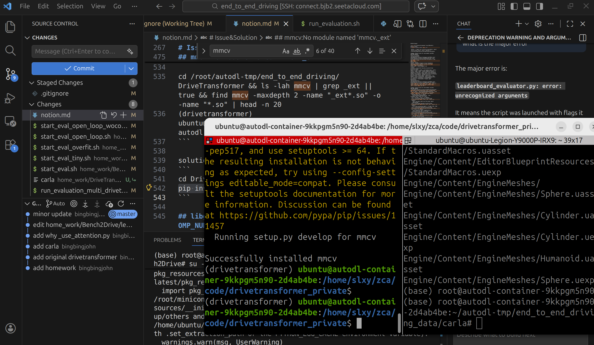
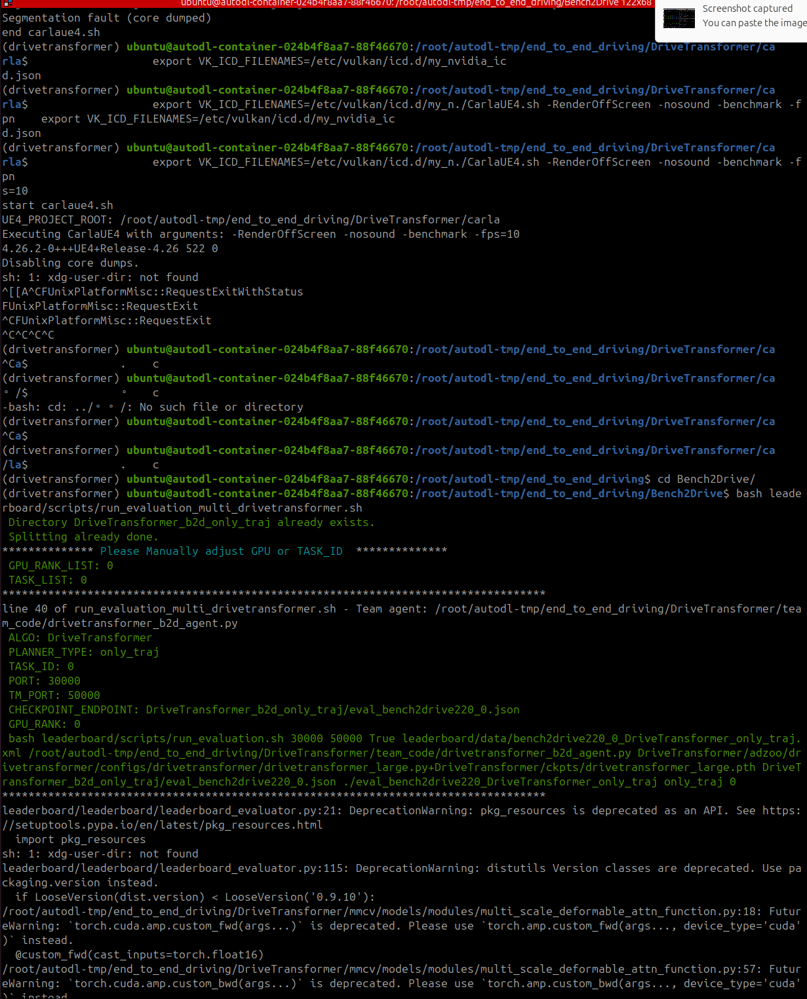
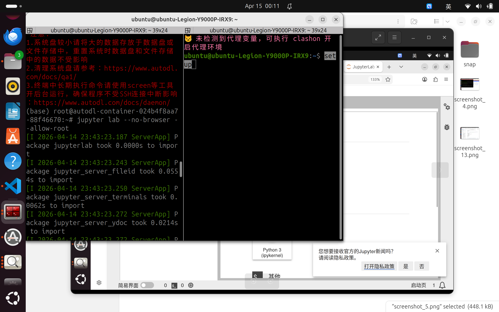

# end_to_end_driving_project

## 项目介绍

端到端自动驾驶实验工程。以 [DriveTransformer](https://github.com/Thinklab-SJTU/DriveTransformer) 为基座，拆成四个递进式实验：先补全动态目标感知、在线建图、规划三部分并在 CARLA 仿真环境中完成推理与可视化，最后自行训练权重跑完整闭环评测。

三种用法，取决于你从哪个分支开始：

- **自学**：从 `main` 出发，对着 lab 说明自己补全填空点，做完与对应的 solution 分支比对
- **跑通验证**：直接用 `lab3-solution`，装好环境即可复现开环/闭环评测与可视化，适合验证环境或快速看效果（用官方预训练权重，不必自己训练）
- **教学**：把 `main` 作为起点分发，solution 分支作为参考实现

### 参考来源

本工程的代码与实验设计均基于以下材料，非原创：

- 课程：[深蓝学院](https://www.shenlanxueyuan.com)《端到端自动驾驶理论与实践》第二期
- 代码源码、作业参考：https://github.com/Thinklab-SJTU/DriveTransformer
- 论文：DriveTransformer: Unified Transformer for Scalable End-to-End Autonomous Driving（[arXiv:2503.07656](https://arxiv.org/abs/2503.07656)）
- 评测框架：[Bench2Drive](https://github.com/Thinklab-SJTU/Bench2Drive) + [CARLA](https://carla.org) 0.9.15 leaderboard / scenario_runner

### 分支组织

分支按实验顺序递进。`main` 是预留好填空点的基准工程，每个实验只改少量文件，后一个实验建立在前一个的结果之上，因此既可以顺着做下来，也可以直接切到任一 solution 分支看完整实现。

| 分支 | 内容 |
| --- | --- |
| `main` | 初始基准工程，预留全部 TODO 填空点，动手做的起点 |
| `lab1-solution` | main + Lab1 参考实现 + lab 报告（开环感知可视化） |
| `lab2-solution` | 基于 lab1-solution，加入在线建图，产出带地图的可视化 |
| `lab3-solution` | 基于 lab2-solution，加入 planner，产出闭环评测结果与可视化 |
| `lab4-solution` | 基于 lab3-solution，自行训练权重并跑完整评测集，产出训练日志与评测分析 |

### 实验安排

四个实验：前三个补全模型的感知、建图、规划三部分，代码里用 `project-1` / `project-2` / `project-3` 关键词标记填空位置，共 10 处编号 TODO；Lab4 不再填空，改为自己训练权重并跑完整评测。

| 实验 | 主题 | 填空点 | 评测 |
| --- | --- | --- | --- |
| Lab1 | 动态 OD 感知：Agent Query 与参考点初始化、注意力掩码、3D 框投影可视化 | TODO-1/2/3、6、9 | 开环 |
| Lab2 | 在线静态建图：Map Query 构建、agent↔map 双向可见、地图点坐标粗到精 refine | TODO-4、6、7 | 开环 |
| Lab3 | 基于 Query 的 Planner：ego 特征编码、三类 query 全互见、规划轨迹 refine | TODO-5、6、8 | 闭环 |
| Lab4 | 端到端训练与评测：数据集准备与预处理、训练配置调整、跑完整评测集并分析结果 | 改配置，无填空 | 闭环（完整集） |

TODO-6（注意力掩码）前三个实验都要动：每个实验在前一个基础上多放开一类可见性，能比较直观地看出「统一 Transformer + 掩码控制信息流向」这个设计思路。

Lab1~Lab3 用的是官方预训练权重，只验证推理链路是否正确；Lab4 才真正自己训练，因此对算力和时间的要求高得多（完整训练需多卡、耗时以天计），也是唯一需要下载 Bench2Drive 数据集的实验。

各 lab 的说明与产出物要求见 [docs/requirement/lab1.md](docs/requirement/lab1.md)。文档为课程原始要求的完整副本，其中的打包提交说明仅在教学场景下适用，自学或验证时跳过即可。

### 目录结构

```
end_to_end_driving_project/
├── Bench2Drive/        CARLA 评测框架（leaderboard + scenario_runner）
├── DriveTransformer/   模型代码（mmcv 精简版 + adzoo 训练推理入口）
├── docs/
│   ├── requirement/    各 lab 说明（labN.md）与配图
│   ├── readme_asset/   README 配图
│   └── report/         实验报告
└── skill/              本工程的操作规范
```

关键代码位置：

- `DriveTransformer/adzoo/drivetransformer/mmdet3d_plugin/ours/drivetransformer_head.py` — head，前向推理与损失计算，TODO-1~5
- `DriveTransformer/adzoo/drivetransformer/mmdet3d_plugin/ours/drivetransformer_layers.py` — Decoder 层，query 间与 query-特征间交互，TODO-6~8
- `Bench2Drive/leaderboard/team_code/drivetransformer_vis_agent*.py` — Agent 主文件，模型加载、预处理、可视化，TODO-9

## 配置过程

完整配置过程与踩坑记录参考 `/home/ubuntu/Projects/end_to_end_driving/notion.md`。

### 环境要求

- Ubuntu 22.04（不支持 Windows / macOS）
- Python 3.8（硬性要求）、CUDA 11.8、GCC 9.4
- CARLA 0.9.15
- GPU：单卡 RTX 4090 可跑通推理与评测；完整训练需要多卡

### 快速开始

```bash
# 1. 创建环境
conda create -n drivetransformer python=3.8 -y
conda activate drivetransformer

# 2. CUDA Toolkit 与 PyTorch
conda install -c "nvidia/label/cuda-11.8.0" cuda-toolkit -y
pip install torch torchvision torchaudio --index-url https://download.pytorch.org/whl/cu118
pip install -U xformers --index-url https://download.pytorch.org/whl/cu118

# 3. 编译依赖与项目核心依赖
pip install ninja packaging
cd DriveTransformer && pip install -v -e .

# 4. 验证
python -c "import torch; print('CUDA:', torch.cuda.is_available()); print('GPU:', torch.cuda.get_device_name(0))"
```

`mmcv` 的三个预编译扩展（`_ext`、`iou3d_cuda`、`roiaware_pool3d_ext`）没有随仓库分发，需由第 3 步在本地编译生成——它们与 Python / CUDA 版本绑定，本地编译比直接拷贝更可靠。这一步耗时较久且长时间没有输出，属正常现象：



CARLA 权重与地图的安装步骤见 [docs/requirement/lab1.md](docs/requirement/lab1.md) 环境配置一节。CARLA 正常启动后的样子：



### 运行

改脚本里的路径为本机实际路径后执行：

```bash
# 开环评测（Lab1 / Lab2）
bash Bench2Drive/start_eval_open_loop_wocontrol.sh

# 闭环评测（Lab3 / Lab4）
bash Bench2Drive/start_eval.sh
```

脚本会拉起 CARLA、加载权重、跑完 route，输出评测 json 与可视化帧。视频 demo 可用 `Bench2Drive/tools/generate_video.py` 生成。

Lab4 额外需要数据预处理与训练两步（数据集下载与目录结构见 lab4 说明）：

```bash
# 数据预处理（耗时较久，改脚本里的路径为本机实际路径）
cd DriveTransformer/adzoo/drivetransformer/mmdet3d_plugin/datasets
python preprocess_bench2drive_drivetransformer.py --workers 16

# 启动训练，末尾数字为 GPU 数
cd DriveTransformer
bash adzoo/drivetransformer/dist_train.sh \
  adzoo/drivetransformer/configs/drivetransformer/drivetransformer_large.py 8
```

`large` 配置显存需求高，单卡或显存不足时可下调配置里的 `batch_size`、网络层数、特征维度。这会影响精度，但 Lab4 的目的是跑通训练与评测全流程、拿到自己的权重，精度达不到官方水平是正常的。评测时 `--routes` 用 `bench2drive220.xml`（完整 220 条），资源有限可换 `drivetransformer_bench2drive_dev10.xml`。

### auto dl使用

在 AutoDL 云服务器上跑的完整指南参考 `/home/ubuntu/Projects/end_to_end_driving/notion.md` 的 AutoDL 章节，要点：

- 实例配置选 RTX 4090 + Ubuntu 22.04，Python 预选 3.8、CUDA 预选 11.8
- 本地 VSCode 装 **Remote - SSH** 插件，`Ctrl+Shift+P` → `Remote-SSH: Connect to Host` 连接实例
- CARLA 拒绝以 root 运行，需先建普通用户并把 `/root/autodl-tmp` 权限放开
- AutoDL 上用 `-RenderOffScreen` 需要先配好 Vulkan，否则报 `VK_ERROR_OUT_OF_HOST_MEMORY`
- 遇到 `No module named 'mmcv._ext'`，说明扩展没编译，回到 `DriveTransformer/` 执行 `pip install -e .`
- `libgomp: Invalid value for environment variable OMP_NUM_THREADS` → `export OMP_NUM_THREADS=1`

JupyterLab 走 SSH 隧道访问：

```bash
# 本地开隧道（本地 8889 → 服务器 8889）
ssh -L 8889:localhost:8889 -p <端口> root@<服务器地址>

# 服务器上启动
jupyter lab --no-browser --allow-root --port=8889
```


