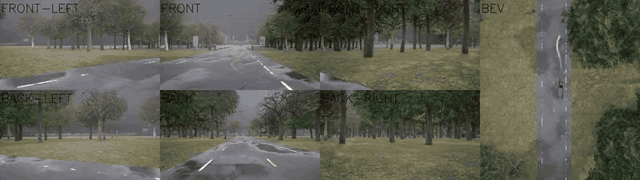
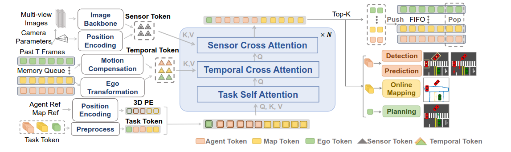

# end_to_end_driving_project



## 项目介绍

端到端自动驾驶实验工程。以 [DriveTransformer](https://github.com/Thinklab-SJTU/DriveTransformer) 为基座，拆成四个递进式实验：先补全动态目标感知、在线建图、规划三部分并在 CARLA 仿真环境中完成推理与可视化，最后自行训练权重跑完整闭环评测。

### 背景：从模块化到一段式端到端

传统自动驾驶是模块化流水线：感知、预测、规划各自独立开发，模块之间靠人工定义的接口（目标框、车道线、规则）传递信息。接口之外的信息被丢掉，误差逐级累积，长尾场景只能靠不断堆规则。

端到端方法把这条链路交给神经网络学习，大致有两条路线：

- **两段式**：感知与规划仍是两个模型，感知输出显式结果，规划模型在此基础上学习决策。工程上好落地，但两段之间仍有信息瓶颈
- **一段式**：从传感器输入到规划轨迹是同一个网络，联合训练、梯度贯通全链路，感知、预测、规划共享特征并为最终驾驶目标共同优化

一段式端到端被普遍视为量产自动驾驶的演进方向，近两年头部车企与智驾厂商也在陆续转向这条路线。理解一段式模型怎么设计、怎么训练、怎么在闭环中评测，是进入这个方向的基础。

### DriveTransformer 简介



<sub>图片引自 Xiaosong Jia, Junqi You, Zhiyuan Zhang, Junchi Yan. *DriveTransformer: Unified Transformer for Scalable End-to-End Autonomous Driving*. ICLR 2025（[arXiv:2503.07656](https://arxiv.org/abs/2503.07656)），版权归原作者所有。</sub>

[DriveTransformer](https://arxiv.org/abs/2503.07656) 由上海交通大学 [Thinklab](https://github.com/Thinklab-SJTU) 的 Xiaosong Jia、Junqi You、Zhiyuan Zhang、Junchi Yan 提出，发表于 ICLR 2025，并开源了[完整代码与权重](https://github.com/Thinklab-SJTU/DriveTransformer)。它是一段式端到端模型，和 UniAD 这类按「感知 → 预测 → 规划」串行堆叠的设计不同，它用一个统一的 Transformer 同时处理所有任务，核心是三点：

- **任务并行**：检测、建图、规划三类 query 在每一层 decoder 里同时交互，而不是上一个任务做完再交给下一个，靠注意力掩码控制谁能看到谁
- **稀疏表征**：query 直接与多视角图像特征做交叉注意力，不构建稠密的 BEV 特征图，计算更省、更易扩展
- **流式处理**：用历史 query 组成的时序记忆传递时间信息，适合在线连续推理

结构简洁、易于放大，同时在 Bench2Drive 闭环评测上表现出色，因此很适合作为学习一段式端到端的切入点：本工程的四个实验正好对应它的感知、建图、规划三类 query 以及完整训练流程。

本工程的实验建立在 DriveTransformer 原作者开源的工作之上，感谢他们公开论文、代码与预训练权重。如果本工程对你有帮助，也请引用原论文：

```bibtex
@inproceedings{jia2025drivetransformer,
  title={DriveTransformer: Unified Transformer for Scalable End-to-End Autonomous Driving},
  author={Xiaosong Jia and Junqi You and Zhiyuan Zhang and Junchi Yan},
  booktitle={International Conference on Learning Representations (ICLR)},
  year={2025}
}
```

三种用法，取决于你从哪个分支开始：

- **自学**：从 `main` 出发，对着 lab 说明自己补全填空点，做完与对应的 solution 分支比对
- **跑通验证**：两个选择——`lab3-solution` 用官方预训练权重，装好环境即可复现开环/闭环评测与可视化，是验证环境、快速看效果的最短路径；`lab4-solution` 代码填空全部完成，除推理外还含训练流程，想连训练一起验证时用它（需额外下载数据集、多卡、耗时以天计）
- **教学**：把 `main` 作为起点分发，solution 分支作为参考实现

### 参考来源

本工程受以下课程与开源工作启发，代码与实验设计参考了这些材料：

- 课程：[深蓝学院](https://www.shenlanxueyuan.com)《端到端自动驾驶理论与实践》第二期
- 代码源码、作业参考：https://github.com/Thinklab-SJTU/DriveTransformer
- 论文：DriveTransformer: Unified Transformer for Scalable End-to-End Autonomous Driving（[arXiv:2503.07656](https://arxiv.org/abs/2503.07656)）
- 评测框架：[Bench2Drive](https://github.com/Thinklab-SJTU/Bench2Drive) + [CARLA](https://carla.org) 0.9.15 leaderboard / scenario_runner

### 分支组织

分支按实验顺序递进。`main` 是预留好填空点的基准工程，每个实验只改少量文件，后一个实验建立在前一个的结果之上，因此既可以顺着做下来，也可以直接切到任一 solution 分支看完整实现。

每个分支都是下一个实验的起点：`main` 对应 Lab1 要求，`lab1-solution` 对应 Lab2 要求，`lab2-solution` 对应 Lab3 要求，`lab3-solution` 对应 Lab4 要求。想做哪个实验，就切到它的前一个分支开始。

| 分支 | 内容 | 在此分支上做 |
| --- | --- | --- |
| [`main`](https://github.com/zhangbb-john/end_to_end_driving_project/tree/main) | 初始基准工程，预留全部 TODO 填空点 | [Lab1 要求](docs/requirement/lab1.md) |
| [`lab1-solution`](https://github.com/zhangbb-john/end_to_end_driving_project/tree/lab1-solution) | main + Lab1 参考实现 + lab 报告（开环感知可视化） | [Lab2 要求](docs/requirement/lab2.md) |
| [`lab2-solution`](https://github.com/zhangbb-john/end_to_end_driving_project/tree/lab2-solution) | 基于 lab1-solution，加入在线建图，产出带地图的可视化 | [Lab3 要求](docs/requirement/lab3.md) |
| [`lab3-solution`](https://github.com/zhangbb-john/end_to_end_driving_project/tree/lab3-solution) | 基于 lab2-solution，加入 planner，产出闭环评测结果与可视化 | [Lab4 要求](docs/requirement/lab4.md) |
| [`lab4-solution`](https://github.com/zhangbb-john/end_to_end_driving_project/tree/lab4-solution) | 基于 lab3-solution，自行训练权重并跑完整评测集，产出训练日志与评测分析 | 全部完成 |

### 实验安排

四个实验：前三个补全模型的感知、建图、规划三部分，代码里用 `project-1` / `project-2` / `project-3` 关键词标记填空位置，共 10 处编号 TODO；Lab4 不再填空，改为自己训练权重并跑完整评测。

| 实验 | 主题 | 填空点 | 评测 |
| --- | --- | --- | --- |
| Lab1 | 动态 OD 感知：Agent Query 与参考点初始化、注意力掩码、3D 框投影可视化 | TODO-1/2/3、6、9 | 开环 |
| Lab2 | 在线静态建图：Map Query 构建、agent↔map 双向可见、地图点坐标粗到精 refine | TODO-4、6、7 | 开环 |
| Lab3 | 基于 Query 的 Planner：ego 特征编码、三类 query 全互见、规划轨迹 refine | TODO-5、6、8 | 闭环 |
| Lab4 | 端到端训练与评测：数据集准备与预处理、训练配置调整、跑完整评测集并分析结果 | 改配置，无填空 | 闭环（完整集） |

TODO-6（注意力掩码）前三个实验都要动：每个实验在前一个基础上多放开一类可见性，能比较直观地看出「统一 Transformer + 掩码控制信息流向」这个设计思路。

Lab1~Lab3 用的是官方预训练权重，只验证推理链路是否正确；Lab4 才真正自己训练，因此对算力和时间的要求高得多（完整训练需多卡、耗时以天计），也是唯一需要下载 Bench2Drive 数据集的实验。

各 lab 的说明见「分支组织」表中「在此分支上做」一列。文档为课程原始要求的完整副本，其中的打包提交说明仅在教学场景下适用，自学或验证时跳过即可。

### 目录结构

```
end_to_end_driving_project/
├── Bench2Drive/        CARLA 评测框架（leaderboard + scenario_runner）
├── DriveTransformer/   模型代码（mmcv 精简版 + adzoo 训练推理入口）
├── docs/
│   ├── requirement/    各 lab 说明（labN.md）与配图
│   ├── setup/          环境配置与常见问题（setup.md）
│   ├── readme_asset/   README 配图
│   └── report/         实验报告
└── skill/              本工程的操作规范
```

关键代码位置：

- `DriveTransformer/adzoo/drivetransformer/mmdet3d_plugin/ours/drivetransformer_head.py` — head，前向推理与损失计算，TODO-1~5
- `DriveTransformer/adzoo/drivetransformer/mmdet3d_plugin/ours/drivetransformer_layers.py` — Decoder 层，query 间与 query-特征间交互，TODO-6~8
- `Bench2Drive/leaderboard/team_code/drivetransformer_vis_agent*.py` — Agent 主文件，模型加载、预处理、可视化，TODO-9

## 配置过程

运行环境为 Ubuntu 22.04 + Python 3.8 + CUDA 11.8 + CARLA 0.9.15，单卡 RTX 4090 可跑通推理与评测，完整训练需要多卡。大致步骤：

1. 用 conda 创建 Python 3.8 环境，装好 CUDA 11.8 Toolkit、PyTorch 与 xformers
2. 在 `DriveTransformer/` 下执行 `pip install -v -e .`，本地编译 mmcv 扩展
3. 安装 CARLA 与地图，下载预训练权重（链接见 [lab1 说明](docs/requirement/lab1.md)）
4. 运行 `Bench2Drive/start_eval_open_loop_wocontrol.sh`（开环，Lab1/2）或 `Bench2Drive/start_eval.sh`（闭环，Lab3/4）

完整命令、Lab4 的数据预处理与训练、AutoDL 云实例的用法以及常见报错的解决办法，见 [docs/setup/setup.md](docs/setup/setup.md)。
