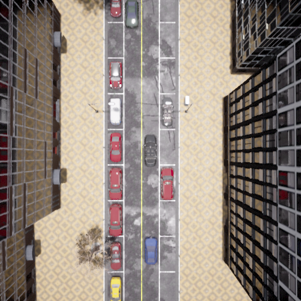
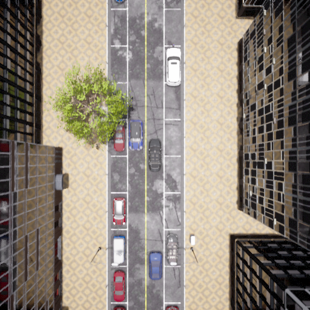
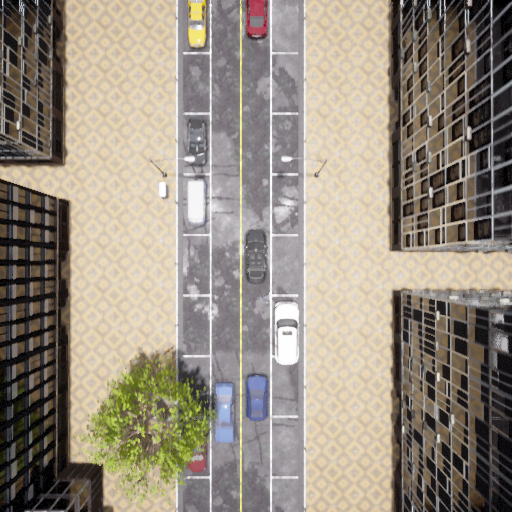
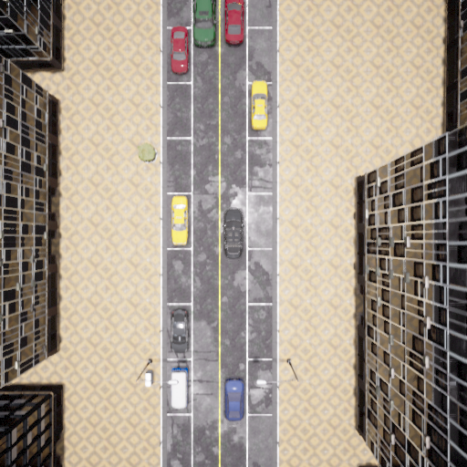
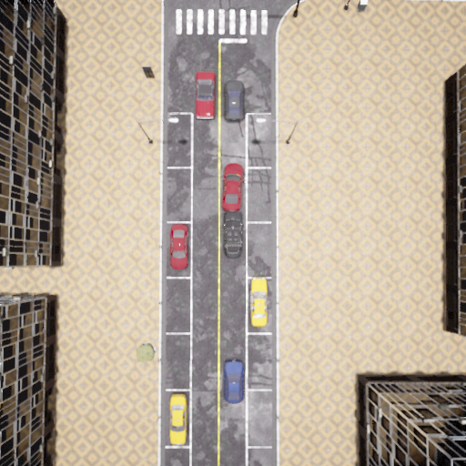
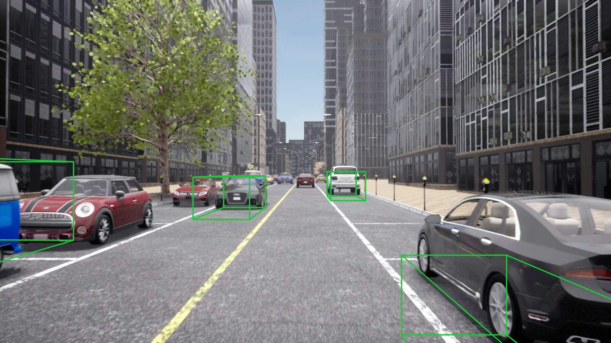
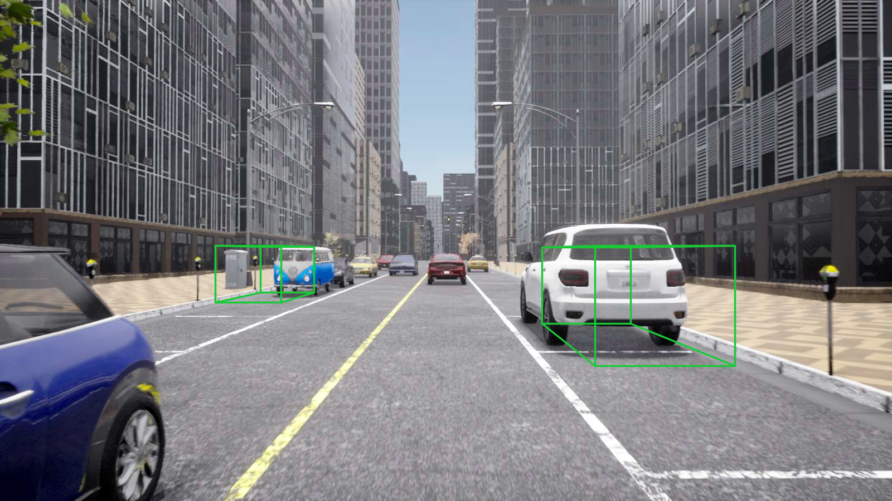
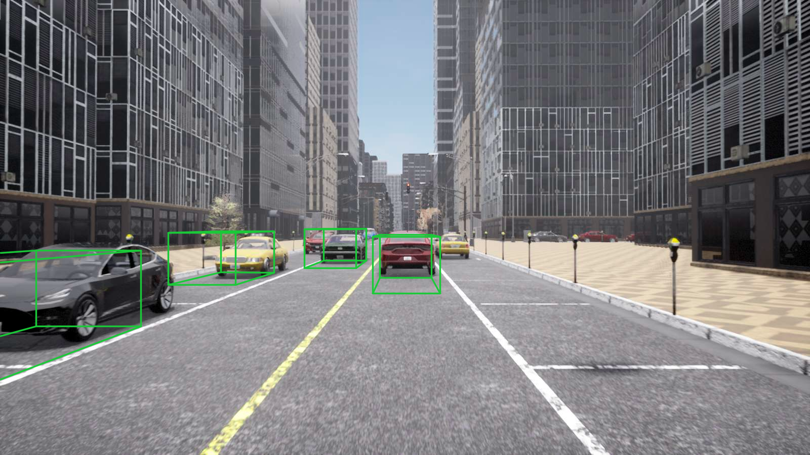
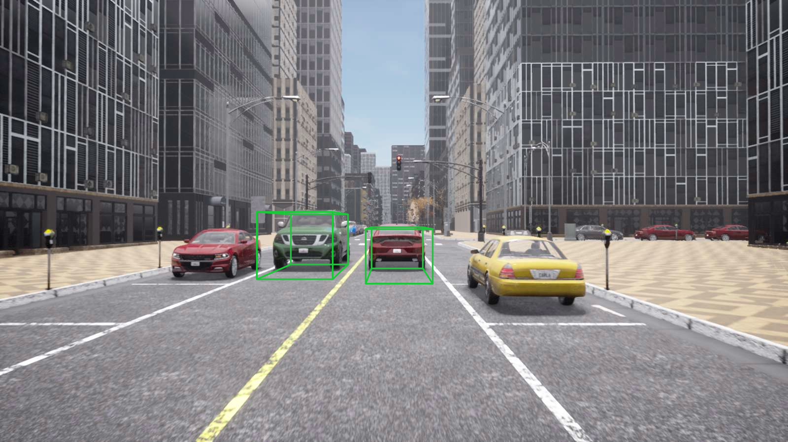
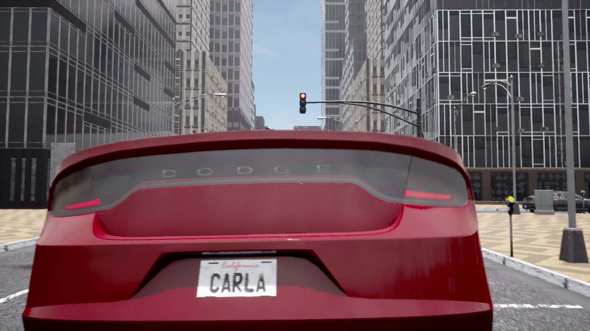

# Chatper2 动态OD感知模型实现与可视化

## 一、本次作业核心完成任务（重点呈现）

- ✅ 基于DriveTransformer，完成动态目标（OD）感知模型的完整推理实现

- ✅ 独立完成3个核心功能模块的代码开发与修改，确保模型正常运行

- ✅ 实现3D检测框到2D图像的投影可视化，完成BEV、前视RGB双视角呈现

- ✅ 在CARLA仿真环境中完成开环评估，可直接运行验证结果

## 二、核心代码修改（可直接核查）

所有修改均围绕作业要求，针对性实现功能，具体如下：

- **drivetransformer\_head\.py**：实现可学习Agent Query与参考点初始化、二维网格离散化及特征适配
TODO-1
```
        self.agent_query = nn.Embedding(self.agent_num_query, self.embed_dims)
        self.agent_reference_points = nn.Embedding(self.agent_num_query, 3)

        ###################################################################
        self.agent_reference_points.requires_grad_(True)
        self.agent_query.requires_grad_(True)
```
TODO-2 
```
        num_grid_per_dim_agent = int(np.ceil(np.sqrt(self.agent_reference_points.weight.shape[0])))
        x = torch.linspace(self.pc_range[0], self.pc_range[3], steps=num_grid_per_dim_agent, device=self.agent_reference_points.weight.device)
        y = torch.linspace(self.pc_range[1], self.pc_range[4], steps=num_grid_per_dim_agent, device=self.agent_reference_points.weight.device)
        x, y = torch.meshgrid(x, y, indexing="xy")
```
（这里把 `int(np.sqrt(...))` 改成了 `int(np.ceil(np.sqrt(...)))`：当 query 数不是完全平方数时，向上取整能保证网格点数 ≥ query 数，配合后面 `x.flatten()[:num_agent_query]` 截断，不会出现参考点不够分配的情况。large 配置下 query 数=900、√=30 为完全平方，两种写法结果一致，属稳健性修正。）
```
            num_agent_query = self.agent_reference_points.weight.shape[0]
```
TODO-3
```
        agent_query = self.agent_query.weight.unsqueeze(0).expand(bs, -1, -1).to(device=img_feats.device, dtype=dtype)
        agent_reference_points = self.agent_reference_points.weight.unsqueeze(0).expand(bs, -1, -1).to(device=img_feats.device, dtype=dtype)
```

- **drivetransformer\_layers\.py**：设计并实现注意力掩码规则，完成agent/map/ego任务间可见性配置。掩码以 `True=屏蔽` 为约定，先全部置 `True`，再按任务区间逐步打开可见性（置 `False`）：

```
                # project-1: agent 看 agent；map 看 agent、map
                mask[agent_range, agent_range] = False
                mask[map_range, agent_range]   = False
                mask[map_range, map_range]     = False
                # project-2: agent 也能看 map（agent↔map 双向）
                mask[agent_range, map_range]   = False
```

- **drivetransformer\_vis\_agent\_open\_loop\_wocontrol\.py**：实现3D检测框到2D图像投影（TODO-9），完成双视角可视化。投影用 `lidar2img` 把框的 8 个角点从雷达系变换到像素齐次坐标后做透视除法（`u=x/z, v=y/z`），并对 `|z|<eps` 的无效/相机后方点做了保护（置大值，后续 mask 过滤），避免除零与错误投影：

```
                pts_2d = (lidar2img_rt @ pts_4d.T).T   # (num_bbox*8, 4)
                eps = 1e-5
                valid = np.abs(pts_2d[:, 2]) > eps
                pts_2d[valid, 0] /= pts_2d[valid, 2]
                pts_2d[valid, 1] /= pts_2d[valid, 2]
                pts_2d[~valid, 0:2] = 1e6              # 无效深度点过滤
```

- **start\_eval\_open\_loop\_wocontrol\.sh**：配置本地运行环境与路径，确保可直接启动评测

 
## 三、快速验证方式（方便老师核查）

在项目根目录执行以下命令，即可启动开环评估，查看仿真与检测结果：

```bash
bash start_eval_open_loop_wocontrol.sh
```
bev
<div align="center">
  
  
  
  
  
</div>
rgb_front

 <div align="center">
  
  
  
  
  
</div>
 
## 四、个人思考

围绕本次几处代码修改，记录一些实现过程中的理解与体会：

1. **参考点初始化为什么要在 BEV 平面铺网格。** Agent query 的参考点不是随机撒，而是用 `meshgrid` 在 `pc_range` 限定的 BEV 平面上均匀铺一层网格（z 固定为 0）。这相当于给每个 query 一个空间先验位置，让它「天然负责」BEV 上某一块区域，后续 query 只需回归相对该锚点的偏移（见 `agent_prep_ref[..., 0:2] += agent_reference_points[..., :2]`）。这种 anchor 式初始化收敛更快也更稳定，比纯可学习的无锚 query 更好优化。把 `int(np.sqrt)` 改成 `int(np.ceil(np.sqrt))` 也是同一思路下的稳健性保证——保证网格点不少于 query 数。

2. **注意力掩码本质是在定义任务间的信息流向。** 把三类 query（agent / map / ego）拼到同一序列里做 self-attention，掩码决定「谁能看谁」。逐步放开的过程其实对应一种设计取舍：project-1 只让感知任务内部交流；project-2 打通 agent↔map（检测能用上车道结构、建图也能参考动态目标）；project-3 让 ego 规划查询同时看到 agent 与 map。最终 `mask[ego_range, :] = False` 让 ego 看到全部——因为规划是下游任务，需要聚合所有感知信息。这种「统一 transformer + 掩码控制可见性」的做法，比为每个任务单独设计 cross-attention 更简洁，也是 DriveTransformer 的核心思想。

3. **3D→2D 投影里透视除法的细节最容易踩坑。** `lidar2img @ pts_4d` 得到的是齐次像素坐标，必须再除以深度 z 才是真正的像素位置。这里关键是对 `z≈0`（位于相机平面或后方）的点做保护：直接除会得到 inf/nan，进而画出乱框。代码用 `eps` 判 valid、把无效点设成 `1e6` 再交给后面的 mask 过滤，是个朴素但有效的处理。这也解释了为什么可视化里偶尔有框「闪现」——本质是边界处深度接近 0 时被过滤了。

4. **开环 vs 闭环的认识。** 本次是开环（wocontrol）评估，模型只做感知/预测、不真正控车，因此能干净地观察检测框质量而不被控制误差污染。它适合验证「感知模块本身对不对」，但不能反映闭环里误差累积、交互博弈等问题——这也是后续章节要用闭环 DS 指标的原因。

补充：**闭环（closed-loop）评估。** 在闭环评估中，模型不仅输出感知/预测信息，还负责生成实际控制命令（转向/油门/刹车），这些命令直接驱动仿真车辆并影响后续观测。闭环评测可以真实反映感知、预测与控制三者的协同效果、误差累积与与其他 agent 的交互博弈能力，因此更能衡量端到端驾驶系统的实际驾驶性能；但它也更容易受到控制器设计、时延与仿真不稳定性的影响。闭环常用指标包括综合驾驶分（DS）、路线完成度与违规惩罚系数等。

代码层面的差异（基于工程实现）

- 相关脚本：`home_work/Bench2Drive/leaderboard/team_code/drivetransformer_vis_agent.py`（标准闭环代理）与 `home_work/Bench2Drive/leaderboard/team_code/drivetransformer_vis_agent_open_loop_wocontrol.py`（开环/可视化变体）。
- 控制流开关：开环脚本通过 `USE_GT_TELEPORT`、`USE_CONTROLLER` 等布尔变量控制行为：
        - `USE_GT_TELEPORT=True` 且 `USE_CONTROLLER=False` 时走 open-loop（返回 open-loop Transform 或 GT waypoint 供记录/teleport），不会将模型预测直接作为车辆控制输入；
        - 关闭这些开关时回退为模型预测 + PID 控制（与闭环脚本等价）。
- run_step 行为差异：
        - 闭环脚本在 `run_step` 内直接使用模型输出 `ego_fut_preds_fix_time / ego_fut_preds_fix_dist` 并调用 `self.controller.step(...)` 生成 `carla.VehicleControl`；
        - 开环脚本在 `USE_GT_TELEPORT` 分支里可返回 `("OPEN_LOOP", next_transform)` 或使用 `get_gt_trajectory_waypoints()` 的 GT waypoints 来驱动车辆（或仅用于记录），并实现了对 hero actor 的 teleport/对齐逻辑。
- 可视化改进（投影修复）：
        - 开环脚本对 3D->2D 投影与可视化做了更完整且稳健的处理，减少渲染错误；建议将该实现同步到闭环脚本以保证可视化一致性。
- 记录与调试：开环脚本增加了大量打印（GT waypoints、对齐信息、map 绘制计数等）和更鲁棒的 `save()` 实现，便于离线分析感知/预测质量而不受控制器干扰。

实践总结：
- 若目的是单纯验证感知/检测与可视化（不想让控制器的行为影响观测），使用 `drivetransformer_vis_agent_open_loop_wocontrol.py`（或在闭环脚本中开启相应开关）；
- 若需要评估端到端性能（感知+预测+控制），使用 `drivetransformer_vis_agent.py`，并确保 `draw_lidar_bbox3d_on_img()` 的投影实现与开环脚本一致以保证可视化一致性。

## 五、作业总结

本次作业依据任务要求完成了动态OD感知的端到端实现与验证，覆盖代码改造、功能联调、开环评估及结果可视化等环节。整体流程运行稳定，关键功能均达到预期，已形成可复现的实验结果并完成提交。

评估结果文件如下：

- [asset/eval_bench2drive220_0_homework.json](asset/eval_bench2drive220_0_homework.json)
- [asset/eval_official.json](asset/eval_official.json)

上述结果分别来自原始homework工程与官方工程；在相同评估设置下，官方工程整体表现略优。
