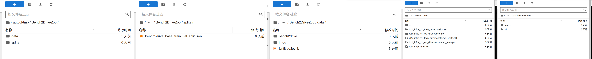
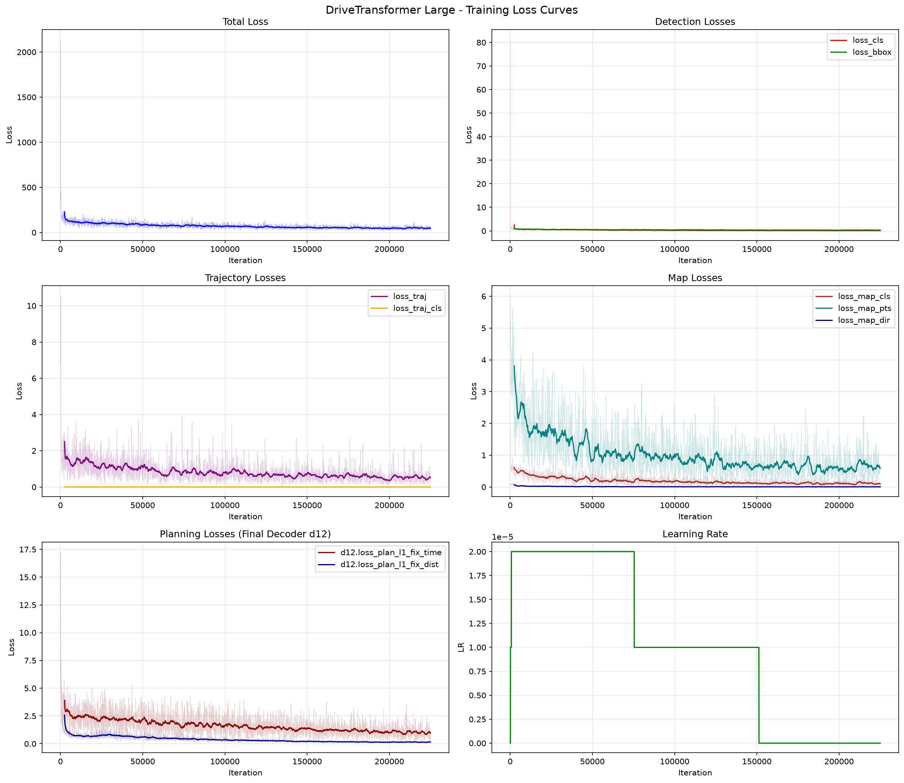

# Project4 端到端模型训练与闭环推理报告

## 1. 项目目标

完成 Bench2Drive 数据集准备、DriveTransformer 训练与闭环评测，最终给出训练过程截图、配置文件与评测分析。

## 2. 数据集准备

### 2.1 数据来源

Bench2Drive Base 版本（官方数据集说明页）：

https://github.com/Thinklab-SJTU/Bench2Drive#Dataset

### 2.2 目录结构

数据集目录结构符合课程要求（完整清单见资产文件）：

- 目录清单：asset/Bench2DriveZoo_tree(5).txt

示例结构（节选）：

```text
/root/autodl-tmp/Bench2DriveZoo
/root/autodl-tmp/Bench2DriveZoo/data
/root/autodl-tmp/Bench2DriveZoo/data/bench2drive
/root/autodl-tmp/Bench2DriveZoo/data/bench2drive/v1
/root/autodl-tmp/Bench2DriveZoo/data/bench2drive/v1/maps
/root/autodl-tmp/Bench2DriveZoo/data/bench2drive/v1/data
```

数据结构截图：



### 2.3 数据预处理

```text
cd /home/slxy/zca/code/drivetransformer_private/adzoo/drivetransformer/mmdet3d_plugin/datasets
python preprocess_bench2drive_drivetransformer.py --workers 16
```

## 3. 训练过程

本次在 4 张 NVIDIA RTX 6000 上对 DriveTransformer-Large 进行了完整训练，配置文件为 [asset/drivetransformer_large.py](asset/drivetransformer_large.py)，训练侧统计详见 [asset/training_report.md](asset/training_report.md)，该卡的环境配置过程记录在 [asset/rtx6000_setup.md](asset/rtx6000_setup.md)。

### 3.1 训练命令

```text
bash adzoo/drivetransformer/dist_train.sh adzoo/drivetransformer/configs/drivetransformer/drivetransformer_large.py 4
```

### 3.1.1 参数设置

- 配置文件路径：DriveTransformer/adzoo/drivetransformer/configs/drivetransformer/drivetransformer_large.py
- 训练设置：num_gpus=4，samples_per_gpu=4（单卡 batch=4），**总 batch_size=16**，total_epochs=60
- 迭代设置：IterBasedRunner，**max_iters=225,000**（num_iters_per_epoch=3750）
- 优化器：AdamW，lr=2e-5，weight_decay=0.01，grad_clip(max_norm=35, norm_type=2)
- 学习率调度：CosineAnnealing，linear warmup（warmup_iters=1000, warmup_ratio=0.1, min_lr_ratio=0.01）
- 混合精度：FP16，loss_scale=512.0；显存占用约 26.6 GB/卡；with_cp=True（梯度检查点）
- 模型维度：embed_dims=768（_dim_=768），ffn=3072，注意力头维度=64，dropout=0.1，激活 SwiGLU
- Transformer：DriveTransformerDecoder 12 层 + Agent/Map Pre-Decoder 各 1 层，memory_len_frame=10
- Query 数量：agent_query_num=900，map_query_num=100（时序传播各 50）
- 轨迹模式：fut_mode=6，自车 fut_ego_mode=1
- 未来轨迹采样：fut_ts=6，fut_ts_ego_fix_dist=20，fut_ts_ego_fix_time=30
- 输入模态：纯相机多视角（use_lidar=False, use_radar=False, use_map=False）
- Backbone/Neck：ResNet50（冻结 stage1，预训练 resnet50-19c8e357.pth）+ FPN(in=2048, out=768)
- 输入图像：原始 900×1600，resize 比例 (0.64, 0.69)，最终 384×1056，随机翻转 + 旋转 (-5.4°, 5.4°)
- 点云范围：point_cloud_range=[-15.0, -30.0, -2.0, 15.0, 30.0, 2.0]，voxel=[0.15, 0.15, 4]
- checkpoint_config interval=3000，log interval=50
- 数据路径：data_root=/root/autodl-tmp/Bench2DriveZoo/data/bench2drive
- 信息路径：info_root=/root/autodl-tmp/Bench2DriveZoo/data/infos
- 地图路径：map_root=/root/autodl-tmp/Bench2DriveZoo/data/bench2drive/maps
- 地图索引：map_file=/root/autodl-tmp/Bench2DriveZoo/data/infos/b2d_map_infos.pkl

### 3.1.2 配置改动对比

| 参数 | 官方 | 本次 | 说明 |
| --- | --- | --- | --- |
| num_gpus | 8 | 4 | 受硬件限制减半 |
| samples_per_gpu（单卡 batch） | 10 | 4 | 单卡显存所限 |
| 总 batch_size | 80 | 16 | 4 卡 × 4 |
| total_epochs | 60 | 60 | 与官方一致 |
| max_iters | — | 225,000 | IterBasedRunner |
| data_root | data/bench2drive | /root/autodl-tmp/Bench2DriveZoo/data/bench2drive | 本地路径 |
| info_root | data/infos | /root/autodl-tmp/Bench2DriveZoo/data/infos | 本地路径 |
| map_root | data/bench2drive/maps | /root/autodl-tmp/Bench2DriveZoo/data/bench2drive/maps | 本地路径 |
| map_file | data/infos/b2d_map_infos.pkl | /root/autodl-tmp/Bench2DriveZoo/data/infos/b2d_map_infos.pkl | 本地路径 |


### 3.2 训练结果摘要

完整训练 225,000 iter，总耗时约 4 天 8 小时（~104 小时），平均每迭代 ~1.4 s，累计样本约 360 万（225,000 × 16）。训练开始 2026-05-30 23:15，结束 2026-06-04 07:32。

各任务损失收敛情况（初始 iter 50 → 最终 iter 225,000）：

| 损失项 | 初始 | 最终 | 说明 |
| --- | ---: | ---: | --- |
| Total Loss | 2142.10 | ~36–47 | 整体下降约 98% |
| 检测分类 loss_cls | 81.36 | 0.06–0.10 | 收敛极显著（>99.9%） |
| 检测回归 loss_bbox | 1.91 | 0.22–0.30 | 稳定收敛 |
| 轨迹回归 loss_traj | 7.55 | 0.28–0.53 | 收敛良好 |
| 轨迹分类 loss_traj_cls | 0.037 | ≈0.000 | 模态选择高度确定 |
| 地图分类 loss_map_cls | 1.85 | ~0.10 | 收敛良好 |
| 地图点回归 loss_map_pts | 5.94 | 0.59–0.64 | 收敛良好 |
| 规划 L1（固定时间） | — | 0.29–0.95 | 权重最高、绝对值最大 |
| 规划 L1（固定距离） | — | 0.10–0.15 | 收敛稳定 |

所有任务（检测、轨迹预测、地图构建、规划）损失均显著收敛，训练过程稳定，未出现发散或异常波动；学习率按 Cosine Annealing 从 2e-5 衰减至接近 0。

训练过程截图：


Loss 随迭代变化曲线（含 Total / 检测 / 轨迹 / 地图 / 规划 / 学习率 共 6 个子图）：



### 3.3 检查点

训练过程中每 3000 iter 保存一次 checkpoint，从 iter_3000 到 iter_225000 全部保留，最终模型 `latest.pth` 对应 iter_225000，亦即本次闭环评测所用权重。

### 3.4 梯度检查点（with_cp）与配套改动

本次在 RTX 6000（单卡 96 GB）上将单卡 batch 提到 4，靠的是开启**梯度检查点**（`with_cp=True`，作用于 12 层主 decoder 及 agent/map prep decoder）。梯度检查点在前向时不保存中间激活、反向时重算一遍，用时间换显存，使大 batch 得以放下；它对输出/梯度数学上中性，不改变收敛结果。但在本项目（新版 PyTorch + DDP）下直接开启会连续触发两个报错，需各打一处源码补丁：

1. **`ValueError: Unexpected keyword arguments: temp_attn_masks`**（`drivetransformer_layers.py`，`DriveTransformerDecoderLayer.forward`）。
   - 根因：decoder layer 以关键字方式接收 `temp_attn_masks`，落入 `**kwargs` 后被原样转发给 `cp.checkpoint`；而新版 `torch.utils.checkpoint.checkpoint` 会先把 kwargs 当成自己的配置项解析，遇到不认识的 `temp_attn_masks` 即报错。
   - 修法：用 lambda 闭包把业务 kwargs 捕获进去，只给 checkpoint 暴露位置参数，并显式 `use_reentrant=False`（非重入实现，能正确处理非梯度的 mask 参数）：
     ```python
     x = cp.checkpoint(
         lambda *inputs: self._forward(*inputs, **kwargs),
         *args,
         use_reentrant=False,
     )
     ```
   - `temp_attn_masks` 是只读注意力掩码、不参与梯度，闭包捕获不影响重算正确性，因此该补丁只解决参数透传、不改变任何数学结果。

2. **`RuntimeError: Expected to mark a variable ready only once`**（`train.py` 的 DDP 构造）。
   - 根因：梯度检查点的反向重算会重建 autograd 子图，叠加 `find_unused_parameters=True` 在前向后额外遍历计算图，导致同一参数（报错落在 `map_prep_decoder...postnorm.weight`）的 ready hook 被触发两次。
   - 修法：按 PyTorch 官方推荐给 DDP 设 `static_graph=True`（只在首个 iter 记录一次计算图、后续复用，天然避免重复标记），同时把 `find_unused_parameters` 关掉（static_graph 自带一次未使用参数检测）：
     ```python
     model = DistributedDataParallel(
         model.cuda(),
         device_ids=[torch.cuda.current_device()],
         broadcast_buffers=False,
         find_unused_parameters=False,  # static_graph 自带未使用参数检测
         static_graph=True,             # 解决 checkpoint 下 marked-ready-twice
     )
     ```
   - 前提：每个 iter 用到的参数集合与控制流需保持一致。本模型注意力/FFN 在 `operation_order` 中固定调用，参数集合每步一致，满足 static 假设；流式时序（首帧 vs 后续帧）经实测前 ~100 iter 不再报错、loss 正常下降，确认可用。

效果：开启后日志 `memory:` 峰值较关闭前明显下降，单卡 batch 得以从 1 提到 4，是本次能在 4 卡上跑满 batch=16、对齐官方 epoch 的关键。两处均为源码补丁（非 config），切分支/`git stash` 时需一并带上。

## 4. 闭环评测

评测脚本与参数根据课程要求调整（routes 选择 bench2drive220.xml 或 dev10）。本次闭环评测采用 8 个并行分片（dev4_0 ~ dev4_7）跑完整个评测集。原始共 216 条 route，其中 dev4_1 有 1 条（VanillaNonSignalizedTurn_1）状态为 `Agent couldn't be set up`——这属于 **agent 初始化失败（CARLA/agent 启动异常的环境问题），并非模型训练或参数导致的驾驶表现差**，模型在该 route 上根本没有真正参与决策（DS 被记为 0）。为避免环境故障拉低统计、误判训练效果，将该条从统计中剔除，**最终纳入统计 215 条**。规划模式为 `only_traj`（闭环、使用模型预测轨迹）。

### 4.1 评测结果

#### 4.1.1 分片结果

**指标说明（DS 是什么）：** DS（Driving Score，综合驾驶分）是 Bench2Drive/CARLA Leaderboard 的核心总分，单条 route 的计算公式为

> **DS = Route Completion × Infraction Penalty**

即 **DS = 路线完成度 × 违规惩罚系数**（对应 JSON 中的 `score_composed = score_route × score_penalty`）。其中：

- **Route（路线完成度，`score_route`，0–100）**：车辆沿规定路线行驶到达的百分比，跑到终点为 100。
- **Penalty（违规惩罚系数，`score_penalty`，0–1）**：从 1.0 起算，每发生一次违规就乘以一个对应的折扣因子并累乘。典型系数：撞车 ×0.60、撞行人 ×0.50、撞静态物 ×0.65、闯红灯 ×0.70、闯 stop ×0.80、偏离车道按比例扣分等。违规越多，系数越接近 0。

因此 DS 同时受「开了多远」和「一路上违规多不多」两方面影响：只有**既跑到终点、又几乎不违规**才能拿到接近 100 的高分；跑到终点但一路碰撞（Route 高、Penalty 低）同样会被压低。整段评测最终报告的 DS 为所有 route 的算术平均。

下表按分片汇总（DS = 综合驾驶分 score_composed，Route = 路线完成度 score_route，Penalty = 违规惩罚系数；Completed = 跑到终点的 route 数，DS=100 = 完美通过数）：

| 分片 | route 数 | DS | Route | Penalty | Completed | DS=100 | 主要失败原因 |
| --- | ---: | ---: | ---: | ---: | ---: | ---: | --- |
| dev4_0 | 28 | 51.99 | 79.37 | 0.634 | 14 | 8 | Blocked 8 / TickRuntime 6 |
| dev4_1 | 27 | 63.29 | 82.33 | 0.748 | 17 | 11 | TickRuntime 5 / Blocked 4 |
| dev4_2 | 28 | 60.37 | 85.42 | 0.682 | 21 | 8 | Blocked 4 / TickRuntime 3 |
| dev4_3 | 25 | 36.25 | 82.67 | 0.411 | 14 | 3 | Blocked 6 / TickRuntime 5 |
| dev4_4 | 27 | 75.67 | 97.56 | 0.773 | 26 | 13 | TickRuntime 1 |
| dev4_5 | 26 | 64.92 | 90.99 | 0.692 | 20 | 9 | TickRuntime 4 / Blocked 2 |
| dev4_6 | 27 | 49.05 | 82.07 | 0.595 | 19 | 6 | TickRuntime 5 / Deviated 2 |
| dev4_7 | 27 | 35.12 | 85.16 | 0.401 | 15 | 2 | TickRuntime 8 / Blocked 4 |
| **合计/平均** | **215** | **54.72** | **85.67** | **0.619** | **146** | **60** | — |

> 注：dev4_1 原始 28 条，剔除 1 条 `Agent couldn't be set up`（环境初始化失败）后为 27 条；合计由 216 条变为 215 条。剔除后 dev4_1 的 DS 由 61.03 升至 63.29、整体 DS 由 54.46 微升至 54.72。

关键指标：

- 综合驾驶分 **DS ≈ 54.7**
- 路线完成度 **Route ≈ 85.7%**
- 惩罚系数 **Penalty ≈ 0.62**
- 成功率（DS=100）**60/215 ≈ 27.9%**
- 跑到终点率（Completed）**146/215 ≈ 67.9%**

DS 分布（215 条）：0–20 分 39 条、20–40 分 51 条、40–60 分 25 条、60–80 分 37 条、80–99 分 3 条、100 分 60 条。完美通过（100 分）和 0–40 区间各占相当比例，分布明显呈双峰。

#### 4.1.2 违规事件统计（全部 route 累计）

| 违规类型 | 事件数 |
| --- | ---: |
| 车辆碰撞 collisions_vehicle | 160 |
| 静态/布局碰撞 collisions_layout | 65 |
| 行人碰撞 collisions_pedestrian | 9 |
| 闯红灯 red_light | 21 |
| 闯 stop 标志 stop_infraction | 23 |
| 被卡住 vehicle_blocked | 29 |
| 偏离车道 outside_route_lanes | 65 |
| 偏离路线 route_dev | 3 |
| 速度过低/不匹配 min_speed_infractions | 3446 |

#### 4.1.3 分场景表现（按平均 DS）

- **较好（DS > 70）**：ParkedObstacle 100.0、HighwayCutIn 100.0、InterurbanAdvancedActorFlow 100.0、InvadingTurn 92.0、HighwayExit 86.0、ParkingCutIn 83.0、ControlLoss 79.0、Accident 75.4、StaticCutIn 74.6、MergerIntoSlowTraffic 73.3
- **中等（DS 45–70）**：OppositeVehicleRunningRedLight 70.4、YieldToEmergencyVehicle 70.0、DynamicObjectCrossing 70.0、HazardAtSideLane 69.9、ParkingCrossingPedestrian 66.0、MergerIntoSlowTrafficV2 62.3、SequentialLaneChange 60.0、SignalizedJunctionLeftTurn 50.8、CrossingBicycleFlow 50.2、T_Junction 49.0、VehicleTurningRoute 45.3
- **很差（DS < 30）**：ConstructionObstacleTwoWays 28.0、BlockedIntersection 27.5、NonSignalizedJunctionLeftTurn 27.5、VehicleTurningRoutePedestrian 26.8、SignalizedJunctionRightTurn 24.7、VanillaNonSignalizedTurn 18.5、EnterActorFlow 17.3、NonSignalizedJunctionRightTurn 15.0

### 4.2 结果分析

#### 4.2.1 整体评价：达到可用水平，接近官方基线

横向对比公开参考结果（用于定位水平，均为完整训练设置下的发表数值）：DriveTransformer-Large 在 Bench2Drive 220-route 上 DS≈63、SR≈35%；UniAD-Base DS≈45.8、SR≈16.4；VAD DS≈42.4、SR≈15.0。本次复现 DS≈54.7、SR≈27.9%，约为官方 DriveTransformer 的 8–9 成，且已明显超过 UniAD/VAD 基线。

结论：**模型已经学会开车，并达到接近官方的可用水平**，属于「质量不错的复现结果」。判断依据是两个指标都较高——**Route 完成度 85.7%（高），Penalty 0.62（中上）**。这说明模型既能正确跟随路线几何（轨迹回归/路网理解成立），违规惩罚也控制在合理范围，DS 被压制的幅度有限。

#### 4.2.2 失败模式：以卡住与少量碰撞为主

- **碰撞仍是主要失分项**：车辆碰撞 160 次 + 布局碰撞 65 次，是 Penalty 未达更高的直接原因。模型沿路行驶稳健，但对动态障碍/交互车辆的避让仍有不足。
- **被卡住（Blocked，多分片首要失败原因）**：在路口、停车出库等场景模型仍会「冻住」不动，表现偏保守，TickRuntime 与 Blocked 是两类主要失败状态。
- 整体呈现「跑完率高、完美通过多、但中间分段仍有较多 0–40 分 route」的双峰特征：**简单/车道保持场景表现优秀（大量 100 分），复杂交互场景（无保护转弯、右转汇入车流）仍是短板**。min_speed 违规 3446 次仍偏高，说明速度策略偏激进。
- 偏离车道 65 次、闯红灯/Stop 共 44 次，反映交通规则与车道保持在交互密集场景下仍不完全稳定。

#### 4.2.3 分场景规律

最好的场景（ParkedObstacle、HighwayCutIn、InterurbanAdvancedActorFlow、HighwayExit）共同点是**以车道保持/轻微避让为主、交互简单**；最差的场景（NonSignalizedJunctionRightTurn、EnterActorFlow、VanillaNonSignalizedTurn、各类无保护转弯、行人横穿转弯 VehicleTurningRoutePedestrian）共同点是**需要对其他 agent 做博弈与时序推理**。这条规律与「交互密集场景仍是规划器主要短板」的判断一致。

#### 4.2.4 可能原因

本次已按官方 epochs（60）训练满 225,000 iter、损失充分收敛，整体接近官方水平。剩余差距（DS≈54.7 vs 官方≈63）与失败模式可归因于：

1. **并行规模与单卡 batch 小于官方**。相比官方本次受硬件限制做了缩减：

   | 参数 | 官方 | 本次 | 影响 |
   | --- | --- | --- | --- |
   | total_epochs | 60 | 60 | 与官方一致 |
   | num_gpus | 8 | 4 | 并行规模减半 |
   | samples_per_gpu（单卡 batch） | 10 | 4 | 单步样本量偏小 |
   | 总 batch_size | 80 | 16 | 约 1/5，梯度估计与归一化统计噪声更大 |

   epoch 数已对齐官方、loss 收敛良好，因此模型主体已较充分训练；与官方的差距主要来自**总 batch 偏小带来的训练动力学差异**，以及复杂交互场景的细节策略，而非「未训练到位/未学会开车」。

2. **总 batch 偏小的副作用**。总 batch=16（官方 80）使梯度估计噪声更大、BN/统计量不够稳定，可能限制了交互密集场景的策略精度，也与 min_speed 违规偏高（速度策略偏激进）相关。

3. **输入模态精简**。配置为纯相机（use_lidar/use_radar/use_map 均为 False），缺少地图与点云先验，对路口几何、可行驶区域与障碍距离的判断更依赖视觉，复杂场景更易出错。

4. **数据分布与长尾**。Bench2Drive 中无保护转弯、行人横穿、施工绕行等强交互场景样本相对稀少，模型优先拟合占多数的「直行/车道保持」分布，导致稀有交互场景仍偏弱——这与 4.2.3 的分场景规律吻合。

5. **部分失败属仿真/环境因素**。统计中仍存在多次 `TickRuntime`（CARLA 运行时超时）等状态，并非纯模型决策失败，会进一步拉低分片均值（如 dev4_3、dev4_7 受此影响明显）。其中 `Agent couldn't be set up`（agent 初始化失败）这一纯环境故障已在 4.1 中剔除、不计入统计；但 TickRuntime 仍混在分数内，若进一步过滤重跑，DS 还有小幅上修空间。
 

## 5. 可视化展示

本次报告提供了数据结构、训练过程截图，以及闭环评测的 demo 视频。

### 5.1 demo 视频

闭环可视化 demo 见 [`video_compressed/`](video_compressed/) 文件夹，各视频均为 BEV + 6 路环视相机拼接渲染，并按表现分为四类：`DS=100`（完美通过）、`成功通过复杂路况`、`开到终点但一路撞`、`被卡住 Blocked`。下面每类选取代表性 route 作分析，评分均取自本次 rtx6000 run 的评测 JSON（原始 `eval_bench2drive_dev4_*.json` 未随报告归档，分数已摘录在下文各条分析中，可按视频文件名中的 RouteScenario 编号对照）。

#### 5.1.1 简单场景完美通过：HighwayCutIn_1（编号 2286，DS=100）

- 视频：[video_compressed/DS=100/RouteScenario_2286_rep0_Town12_HighwayCutIn-compressed.mp4](video_compressed/DS=100/RouteScenario_2286_rep0_Town12_HighwayCutIn-compressed.mp4)
- 对应 route：dev4_0 / RouteScenario_2286_rep0 / Town12，**Route=100、Penalty=1.0、DS=100**，零碰撞零违规完美通过（仅 19 次 min_speed 轻微速度违规，不扣 Penalty）。
- 分析：高速切入/汇入 route，主车任务以**车道保持 + 对切入车做轻微纵向避让**为主，交互简单、博弈成分低。视频中模型预测轨迹平滑贴合车道中心，遇旁车切入能稳定减速跟车、不抢不僵。这正符合第 4 章「以车道保持为主、交互简单的场景表现最好」的规律——也是模型拟合最充分、最稳健的分布。同目录下 `MergerIntoSlowTraffic`（编号 2273）、`VanillaSignalizedTurnEncounterRedLight`（编号 2373）、`HighwayCutIn`（编号 3072）三条同为 DS=100，规律一致。

#### 5.1.2 复杂路况也能成功：OppositeVehicleRunningRedLight_1（编号 2082，DS=100）

- 视频：[video_compressed/成功通过复杂路况/RouteScenario_2082_rep0_Town12_OppositeVehicleRunningRedLight-compressed.mp4](video_compressed/成功通过复杂路况/RouteScenario_2082_rep0_Town12_OppositeVehicleRunningRedLight-compressed.mp4)
- 对应 route：dev4_0 / RouteScenario_2082_rep0 / Town12，**Route=100、Penalty=1.0、DS=100**，零碰撞零违规通过。
- 分析：这是一个**强交互**场景——对向车闯红灯横穿路口，主车必须识别这一违规冲突并主动让行，属于需要「对其他 agent 的违规行为做出反应」的博弈类任务，难度远高于 5.1.1 的车道保持。视频中主车在路口前对横穿车辆完成减速避让、待冲突解除后再通过。这条并非孤例：OppositeVehicleRunningRedLight 全 5 条里有 3 条零违规通过（§4.1.3 均分 70.4），InterurbanAdvancedActorFlow 5 条全过。这说明模型**并非只会简单场景**，在部分强交互场景下也具备正确决策能力。但能力**按场景类型高度分化**——汇流类近乎全过，无保护转弯类却几乎全军覆没，整体复杂场景仅约 19% 零碰撞高分通过。这种「会的很稳、不会的全崩」正是第 4 章「双峰」分布的上峰来源。

#### 5.1.3 失败模式 A：开到终点但一路撞——PedestrianCrossing_1（编号 27582，DS=0.9）

- 视频：[video_compressed/开到终点但一路撞/RouteScenario_27582_rep0_Town11_PedestrianCrossing-compressed.mp4](video_compressed/开到终点但一路撞/RouteScenario_27582_rep0_Town11_PedestrianCrossing-compressed.mp4)
- 对应 route：dev4_7 / RouteScenario_27582_rep0 / Town11，状态 Completed 但 **Route=100、Penalty=0.009、DS=0.9**；违规含**撞车 6 次 + 撞行人 1 次 + 闯红灯 1 次**。
- 分析：典型的「**开到了终点、但一路撞**」失败——路线几何完成度满分，分数却被密集碰撞惩罚压到几乎为 0，正对应第 4 章 Route 高 / Penalty 低的双指标反差。行人横穿场景本应减速让行，模型却维持原速直行、反复刮蹭甚至撞到行人，反映出**对动态障碍/交互车辆的避让能力弱、cost/价值评估欠拟合**。同目录下 `StaticCutIn`（编号 25358，DS=13.0，撞车 4 次）、`EnterActorFlow`（编号 11755，DS=14.6，撞车 3 次 + 闯红灯）是同一模式的不同剧烈程度。

#### 5.1.4 失败模式 B：被卡住 Blocked——VanillaNonSignalizedTurn_1（编号 2390，DS=24.0）

- 视频：[video_compressed/被卡住 Blocked/RouteScenario_2390_rep0_Town12_VanillaNonSignalizedTurn-compressed.mp4](video_compressed/被卡住%20Blocked/RouteScenario_2390_rep0_Town12_VanillaNonSignalizedTurn-compressed.mp4)
- 对应 route：dev4_0 / RouteScenario_2390_rep0 / Town12，状态 **Failed - Agent got blocked**，**Route 仅 43.96、Penalty=0.546、DS=24.0**，含 1 次布局碰撞 + 1 次 vehicle_blocked。
- 分析：与失败模式 A 相反——这里模型**过度保守、停在半路不动**导致路线未跑完（Route 不足 50）。无信号灯路口需要主车主动判断时机汇入/转弯，模型迟迟不敢动作、最终被判定 Blocked。这正是第 4 章所述「复杂交互场景要么贸然通过撞上、要么僵住不动」中的「僵住」一极。同目录下 `VanillaNonSignalizedTurnEncounterStopsign`（编号 2416，DS=20.6）、`HardBreakRoute`（编号 26456，DS=7.9）同为 Blocked 失败。

> 小结：四类视频正好对应第 4 章的结论——简单场景稳定满分（5.1.1）、复杂场景按类型分化（5.1.2，全部 111 条复杂交互 route 中约 19% 零碰撞高分通过、62% 能跑到终点：汇流类如 InterurbanAdvancedActorFlow 近乎全过，无保护转弯类则几乎全军覆没），失败则两极分化为「撞」（5.1.3）与「卡」（5.1.4）。这种双峰行为是欠训练规划器、cost/价值评估两极化的典型特征。


## 对比rtx4090

本节把本次 rtx6000 run 与早先在 RTX 4090 上跑的一版结果做对比，逐条 route 的明细见 [asset/compare_4090_vs_rtx6000_by_id.md](asset/compare_4090_vs_rtx6000_by_id.md)（共同编号 214 条：变好 154、退步 25、持平 35）。**需要先澄清：两次差异的主因是「训练量」，不是显卡本身。** 4090 那版是严重欠训练的早期复现（total_epochs=12、batch_size=1、约 45,000 iter 时保存的 checkpoint，日志显示 loss 仍高达 134、远未收敛）；rtx6000 这版是完整训练（total_epochs=60、总 batch=16、225,000 iter、loss 收敛）。所以下面的对比本质是**「欠训练 vs 训练充分」**，RTX 6000 的大显存只是让 batch 提到 4、把完整训练跑通的手段，而非性能提升的直接来源。

### 整体指标对比

| 指标 | 4090（欠训练，epoch=12/bs=1） | rtx6000（完整，epoch=60/bs=16） | 变化 |
| --- | ---: | ---: | ---: |
| 综合驾驶分 DS | 28.31 | 54.72 | **+26.4（≈翻倍）** |
| 路线完成度 Route | 70.70 | 85.67 | +15.0 |
| 惩罚系数 Penalty | 0.402 | 0.619 | +0.217 |
| 跑到终点率 Completed | 36.3% | 67.9% | +31.6pt |
| 完美通过率 DS=100 | 4.7% | 27.9% | +23.2pt |

提升最大的是 Penalty（0.40→0.62）——说明训练充分后「一路上撞得少了」，这正是 DS 翻倍的主要来源；Route 也从 70.7 升到 85.7，跑到终点的比例几乎翻倍。

### 分场景变化：38 类中 34 类上涨、仅 4 类下降

按场景类型（去掉尾号、对每类 DS 取均值）对比：

**变好最多的场景（Top 15）**

| 场景类型 | 4090 | rtx6000 | Δ |
| --- | ---: | ---: | ---: |
| HighwayExit | 20.9 | 86.0 | +65.0 |
| InterurbanAdvancedActorFlow | 39.9 | 100.0 | +60.1 |
| ControlLoss | 22.3 | 79.0 | +56.7 |
| ParkingCutIn | 28.8 | 83.0 | +54.2 |
| ParkedObstacle | 46.8 | 100.0 | +53.2 |
| InvadingTurn | 39.0 | 92.0 | +53.0 |
| Accident | 23.2 | 75.4 | +52.2 |
| StaticCutIn | 22.5 | 74.6 | +52.1 |
| OppositeVehicleRunningRedLight | 25.2 | 70.4 | +45.1 |
| DynamicObjectCrossing | 31.6 | 70.0 | +38.4 |
| HardBreakRoute | 9.9 | 48.0 | +38.1 |
| T_Junction | 11.2 | 49.0 | +37.8 |
| ParkingCrossingPedestrian | 28.6 | 66.0 | +37.4 |
| ConstructionObstacle | 6.0 | 42.1 | +36.0 |
| SignalizedJunctionLeftTurn | 15.4 | 50.8 | +35.5 |

涨幅最大的集中在**静态/单体障碍处理类**（HighwayExit、ParkedObstacle、StaticCutIn、Accident、ControlLoss、施工绕行）——这些从「不及格」直接跳到「优秀甚至满分」。原因是这类场景模式相对固定、靠充分训练即可学好，欠训练时却最先崩。

**性能掉下来的场景（全部 4 类）**

| 场景类型 | 4090 | rtx6000 | Δ |
| --- | ---: | ---: | ---: |
| EnterActorFlow | 35.7 | 17.3 | **−18.5** |
| NonSignalizedJunctionRightTurn | 23.0 | 15.0 | −8.0 |
| VanillaNonSignalizedTurn | 29.1 | 23.2 | −5.9 |
| PedestrianCrossing | 38.9 | 36.8 | −2.0 |

### 差异解释

1. **整体大涨来自训练充分**：4090 版在 ~45,000 iter、loss=134 时就停了，属明显欠拟合；rtx6000 版训满 225,000 iter 至收敛。模型先学会的是占多数的「直行/车道保持/静态避障」分布，所以这些场景提升最猛，Penalty 随之大幅回升、DS 翻倍。

2. **4 类下降的共性**：`EnterActorFlow`、`NonSignalizedJunctionRightTurn`、`VanillaNonSignalizedTurn` 都属于**无保护、需要主动抢时机汇入/转弯**的场景。其余强交互场景（汇流、左转、横穿）反而大涨，说明这不是「复杂场景整体退步」，而是这一小簇「无保护抢行」任务在训练充分后**策略更保守**——宁可等也不抢，于是更容易卡住（对应 §5.1.4 的 Blocked 失败模式）。换句话说，模型从欠训练时的「乱抢（偶尔蒙对、也偶尔撞）」收敛到「保守不抢（更安全但易 Blocked）」，在这几类抢行场景上单看 DS 反而略降。PedestrianCrossing 的 −2.0 在噪声范围内，不具统计意义。

3. **结论**：本次对比验证了 4090 报告「训练严重不足是 DS 偏低首因」的判断——把训练补足（epoch 12→60、batch 1→16、iter 45k→225k）后，DS 从 28.3 升到 54.7、接近官方水平。剩余短板集中在「无保护抢行」这一小类需要博弈时序推理的场景，是后续优化的重点。


## 未来计划

### 已知环境限制：能训练、暂不能闭环测试

RTX PRO 6000 是 Blackwell（sm_120），需 CUDA≥12.8 才能驱动，进而要 torch≥2.7、Python≥3.9（本次 CUDA 13.0 + torch 2.12 + Python 3.10）。而 CARLA 0.9.15 客户端只有 py3.7 egg，Python 3.10 加载即段错误（`import carla` SIGSEGV）。结果是训练侧（纯 PyTorch）正常、测试侧（须 `import carla`）受阻。展望：为 Python 3.10 装匹配的 cp310 carla wheel，即可在同一新环境打通闭环评测。

### 后续优化方向

- 增大并行规模与总 batch（向官方 8 卡、总 batch=80 靠拢），缓解小 batch 带来的训练动力学差异。
- 过滤/重跑 TickRuntime 等环境故障 route，得到更干净的纯模型表现评估。
- 引入地图/BEV 先验等更多输入模态，针对交互密集场景做数据增采样，并与开源参数对比结果。