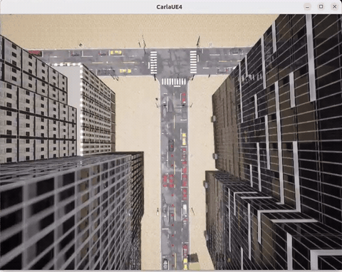
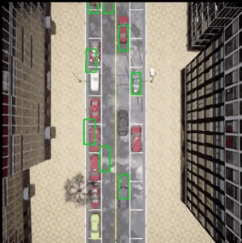
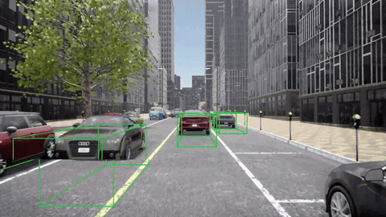

# Project1 动态OD感知模型实现与可视化

## 1.  项目目标
本项目聚焦自动驾驶端到端模型的动态OD（Object Detection，目标检测）感知与开环评测可视化，核心目标包含两部分：
1.  基于[DriveTransformer](https://arxiv.org/abs/2503.07656)，理解端到端自动驾驶中动态OD感知的核心设计，完成OD感知的模型推理；
2.  基于设定的GT（GroundTruth，真值）轨迹数据进行控车，完成开环评测。实现OD感知结果（检测框）的可视化，完成开环定性分析。

## 2.  核心思路
### 2.1  动态OD感知的核心逻辑
项目基于DriveTransformer进行设计，动态OD感知依托统一Transformer架构实现，通过Agent Query实现道路目标（车辆、交通灯、交通牌等）的3D检测，输出目标的位置、尺寸等。
### 2.2  开环评测的核心逻辑
借助CARLA仿真环境，以WayPoint（路点）轨迹为基础实现车辆控制，同步运行DriveTransformer模型推理流程，通过可视化手段呈现感知结果与车辆运行状态，完成开环定性分析（核心验证感知精度，不涉及实时决策能力评估）。
## 3.  操作步骤
### 3.1  环境配置
#### 3.1.1  基础依赖
- 操作系统：DriveTransformer团队和深蓝项目开发团队使用的是Ubuntu22.04，项目不支持Windows或macOS系统
- GPU显卡：DriveTransformer团队研发使用的是八卡A100（单卡显存80G）；深蓝项目团队使用的是单卡RTX4090（显存48G）
- Python版本：3.8（硬性要求，需严格匹配）
- CUDA版本：11.8（推荐版本）（PyTorch版本需与CUDA版本匹配）
- GCC：9.4（推荐版本）
- CARLA 0.9.15：下载链接 [https://carla-releases.s3.us-east-005.backblazeb2.com/Linux/CARLA_0.9.15.tar.gz](https://carla-releases.s3.us-east-005.backblazeb2.com/Linux/CARLA_0.9.15.tar.gz)（点击链接自动下载）

##### 3.1.2  DriveTransformer Conda环境

```Shell
# 1.创建并激活conda环境 
conda create -n drivetransformer python=3.8
conda activate drivetransformer

# 2.安装 CUDA Toolkit 11.8
conda install -c "nvidia/label/cuda-11.8.0" cuda-toolkit

# 3.安装 PyTorch 和 xformers
pip install torch torchvision torchaudio --index-url https://download.pytorch.org/whl/cu118
pip install -U xformers --index-url https://download.pytorch.org/whl/cu118

# 4.配置GCC与CUDA路径（替换YOUR_GCC_PATH、YOUR_CUDA_PATH为本地实际路径）
export PATH=YOUR_GCC_PATH/bin:$PATH
export CUDA_HOME=YOUR_CUDA_PATH/

# 5.安装辅助依赖
pip install ninja packaging

# 6.安装仓库核心依赖
pip install -v -e .
```

#### 3.1.3 下载项目代码
从深蓝学院《端到端自动驾驶》课程第2章下载代码文件并解压。
**说明：你可以通过在代码中搜索“project-1”快速定位作业中，需要你补全代码的部分。**

#### 3.1.4 下载预训练模型


```Shell
# 7.在解压后的项目代码文件夹中，创建权重存储目录
mkdir ckpts 
```

下载以下两个预训练权重文件，并存入上述创建的`ckpts`目录：

- `resnet50-19c8e357.pth`：可从 [Hugging Face](https://huggingface.co/rethinklab/Bench2DriveZoo/blob/main/resnet50-19c8e357.pth)、[百度网盘](https://pan.baidu.com/s/1LlSrbYvghnv3lOlX1uLU5g?pwd=1234) 或 PyTorch 官网获取；
- `drivetransformer_large.pth`：可从 [Google Drive](https://drive.google.com/file/d/1wAXFWfjJm0cmP_pmgTkwxTUEs6Zu5j6i/view?usp=sharing) 或 [百度网盘](https://pan.baidu.com/s/1ZunlLWRJXIblEG_L8rxRew?pwd=1234) 获取。

#### 3.1.5  安装 CARLA 0.9.15
如果你已完成 CARLA 的下载和解压操作，可忽略下述关于下载、解压 CARLA 的命令行。


```Shell
# 1.在解压后的项目代码文件夹中，创建CARLA目录并进入
mkdir carla
cd carla

# 2.下载并解压CARLA 0.9.15
wget https://carla-releases.s3.us-east-005.backblazeb2.com/Linux/CARLA_0.9.15.tar.gz
tar -xvf CARLA_0.9.15.tar.gz

# 3.载并导入额外地图
cd Import && wget https://carla-releases.s3.us-east-005.backblazeb2.com/Linux/AdditionalMaps_0.9.15.tar.gz
cd .. && bash ImportAssets.sh

# 4.设置CARLA根目录环境变量（替换为实际路径）
export CARLA_ROOT=YOUR_CARLA_PATH
```

替换`YOUR_CONDA_PATH`（conda 安装路径）和`YOUR_CONDA_ENV_NAME`（即`drivetransformer`），解决 Python 环境找不到 CARLA 包的问题。

```Shell
echo "$CARLA_ROOT/PythonAPI/carla/dist/carla-0.9.15-py3.7-linux-x86_64.egg" >> YOUR_CONDA_PATH/envs/YOUR_CONDA_ENV_NAME/lib/python3.8/site-packages/carla.pth
```

### 3.2  动态OD感知模型实现
#### 3.2.1  核心模块理解
建议先熟悉DriveTransformer的OD感知核心代码分布，明确各文件功能，为后续修改开发奠定基础：

- `DriveTransformer/adzoo/drivetransformer/mmdet3d_plugin/ours/drivetransformer_head.py`：DriveTransformer的head部分，主要完成模型的前向推理与损失计算；
- `DriveTransformer/adzoo/drivetransformer/mmdet3d_plugin/ours/drivetransformer_layers.py`：DriveTransformer Decoder层，主要实现目标Query与Query，Query与特征之间的交互；
- `DriveTransformer/team_code/drivetransformer_b2d_agent.py`：Agent主文件，包含模型加载、输入预处理、推理逻辑。

#### 3.2.2 Embedding构建

***修改文件：drivetransformer_head.py***

实现智能体查询特征（agent_query）与参考点（agent_reference_points）的初始化逻辑，查询特征需通过可学习的嵌入映射方式构建，替换原有随机初始化代码。

```Python
###################################################################
# project-1
# TODO-1 
# Init agent query and agent_reference_points
# self.agent_query shape:[self.agent_num_query, self.embed_dims]
# self.agent_reference_points shape:[self.agent_num_query, 3]

# 替换此处代码
self.agent_query = torch.randn(self.agent_num_query, self.embed_dims).to("cuda")
self.agent_reference_points = torch.randn(self.agent_num_query, 3).to("cuda")

###################################################################
```

#### 3.2.3  网格离散化

***修改文件：drivetransformer_head.py***

实现智能体参考点的**二维网格坐标初始化**，替换原有随机初始化代码，生成规则的 xy 平面网格作为参考点基础坐标。

1. **坐标范围严格匹配**：
   1. x 轴坐标：在点云范围`pc_range[0]`（最小值）到`pc_range[3]`（最大值）之间均匀取值
   2. y 轴坐标：在点云范围`pc_range[1]`（最小值）到`pc_range[4]`（最大值）之间均匀取值
2. **网格生成规则**：x、y 均按`num_grid_per_dim_agent`个维度生成均匀步长的坐标，通过`meshgrid()`生成二维网格，索引模式固定为`"xy"`（需显式指定）
3. **形状与设备要求**：生成的 x、y 张量形状均为`[num_grid_per_dim_agent, num_grid_per_dim_agent]`，设备为 CUDA，数据类型为浮点型

```Python
    ###################################################################
    # project-1
    # TODO-2 
    # init agent reference points
    # x: pc_range[0], pc_range[3], step=num_grid_per_dim_agent
    # y: pc_range[1], pc_range[4], step=num_grid_per_dim_agent
    # index="xy"
    # x, y = meshgrid()
    # 替换此处代码
    x = y = torch.randn(num_grid_per_dim_agent, num_grid_per_dim_agent).to("cuda")
    
    ###################################################################
```

#### 3.2.4 Query初始化
***修改文件：drivetransformer_head.py***

从类内已定义的嵌入层权重中提取智能体查询特征与参考点，完成维度扩展和设备/数据类型适配，替换原有随机生成代码。

```Python
###################################################################
# project-1
# TODO-3 get agent_query and agent_reference_points from self.agent_query.weight and self.agent_reference_points.weight
# agent_query = nn.Embedding.weight (N, D) -> (bs, N, D) .to(dtype)
# agent_reference_points = nn.Embedding.weight (N, D) -> (bs, N, D)
# 替换此处代码
agent_query = torch.randn(bs, self.agent_query.shape[0], self.agent_query.shape[1]).to("cuda")
agent_reference_points = torch.randn(bs, self.agent_reference_points.shape[0], \
                                     self.agent_reference_points.shape[1]).to("cuda")

###################################################################
```

#### 3.2.5 Agent Mask
***修改文件：drivetransformer_layers.py***

实现注意力掩码（attention mask）的**任务间可见性规则配置**，通过切片赋值修改基础掩码矩阵，让指定任务模块互相可见（mask=False）、未指定模块保持不可见（mask=True），替换原有`pass`占位代码。

提示：掩码矩阵`mask`形状为`[total, total]`，**True 表示该位置注意力被屏蔽（不可见），False 表示注意力开放（可见）**；已通过切片划分 3 个任务区间，通过切片赋值实现规则，无需新增变量/循环：

- `agent_range`：智能体查询区间（0 ~ n_agent）
- `map_range`：地图查询区间（n_agent ~ n_agent+n_map）
- `ego_range`：自车查询区间（n_agent+n_map ~ total），固定为 1 个查询

```Python
        ##############################################################
        # project-1
        # TODO-6 attention mask, ego query 
        n_agent = agent_query_num
        n_map = map_query_num
        n_ego = 1
        total = n_agent + n_map + n_ego
        # 创建基础掩码（True表示需要mask）
        mask = torch.ones(total, total, dtype=torch.bool, device=query.device)
        # 定义任务区间
        agent_range = slice(0, n_agent)
        map_range = slice(n_agent, n_agent + n_map)
        ego_range = slice(n_agent + n_map, total)
        # 设置任务间不可见（mask=True）
        # 任务内部可见（mask=False）
        ##############################################################
        # project-1
        # 允许agent看agent
        # 替换此处代码
        pass
        # 允许map看agent, map
        # 替换此处代码
        pass
        ###############################################################
```

### 3.3 开环评测启动与可视化
开环评测所需XML文件已内置，路径为：

```Plain
Bench2Drive/leaderboard/data/drivetransformer_bench2drive_dev10_open_loop.xml
```

该文件包含Ego车辆的GT轨迹与帧级输入数据标注，无需额外下载。

#### 3.3.1  启动脚本
项目提供专用启动脚本`start_eval_open_loop_wocontrol.sh`，用于一键触发开环评测全流程，规避手动逐行执行命令的繁琐性，确保环境变量、模型加载、仿真启动等环节的一致性。

提示：你需要修改脚本中的路径为自己的实际路径。

执行以下命令启动评测：

```Bash
bash start_eval_open_loop_wocontrol.sh
```

#### 3.3.2  CARLA可视化开启【可选】
***注：服务器无可视化可不打开可视化，直接跳过该过程。***

CARLA仿真环境默认采用离线模式`-offscreen`运行，仅后台执行计算任务，无图形化界面输出。若需实时观测仿真场景（含自车运动、路点分布、环境元素），需修改`leaderboard/leaderboard_evaluator.py`文件（约213行），关闭离线模式以启用可视化窗口，具体操作如下：

- 注释原离线模式配置代码：`# command += " -offscreen"`。
- 如果使用的是 VSCode 编辑器，`Ctrl+shift+P`输入 `leaderboard_evaluator.py:213`，打开注释行，注释掉下一行，达到关闭掉 `-offscreen`选项的目的，调用 carla 可视化，方便 debug。
- 保存修改后重启评测脚本，即可弹出CARLA仿真可视化窗口，实时呈现仿真过程。

#### 3.3.3 动态OD检测框可视化

***修改文件：drivetransformer_vis_agent_open_loop_wocontrol.py***

实现**3维点云齐次坐标到2维图像坐标的投影**，利用激光雷达到图像的变换矩阵 `lidar2img_rt` （包含内参外参）完成投影计算，替换原有直接赋值的占位代码

- `pts_4d`：激光雷达坐标系下的**3维点云的齐次坐标**、设备与数据类型已适配，齐次坐标格式为 `[x, y, z, 1]`（最后一维固定为 1，用于矩阵变换）
- `lidar2img_rt`：激光雷达到图像的**投影变换矩阵**（外参 + 内参组合），形状为 `[4, 4]`，可直接用于齐次坐标的投影计算
- `pts_2d`：投影后的**2 维图像坐标，**严格遵循**齐次坐标矩阵乘法**实现 3D→2D 投影。

```Plain
    ################################################
    # project-1    
    # TODO-9 vis 3d bbox
    # project pts_4d to image2d using lidar2img_rt
    # 替换此处代码
    pts_2d = pts_4d
    ################################################ 
```

#### 3.3.4 项目demo展示
完成上述开发后，可达成以下Demo效果：

- CARLA仿真窗口**【有可视化条件可提交】**：自车沿预设GT轨迹行驶，路面显示红色路点；（demo视频中心的黑车为自车 Ego，视频中红色点为 WayPoints）



- 可视化检测框的BEV和rgb_front视角视频或动图gif。



## 4. 作业提交说明
### 4.1  提交内容

1. **代码文件**：仅提交修改/新增的文件，包括：
   1. 上述代码填空所涉及的所有文件；
   2. 修改后的`start_eval_open_loop_wocontrol.sh`（启动脚本）；
   3. 其他自定义修改的文件（如leaderboard_evaluator.py的可视化开关，或者其他改动的文件都可提交）；
2. **可视化结果**：
   1. 可视化检测框的BEV和rgb_front视角视频或动图gif：
      - 每帧图像含检测框结果，如果提交视频，注意视频长度不要太长；
      - 有其他视频创意更好（加分项）。
   2. 拼接后的RGB图像视频（包含OD感知结果绘制）；
   3. （可选）OD感知结果的JSON文件（每帧的检测框、预测轨迹）；
4. **说明文档**（可选，加分项）：简要说明OD感知模型的实现逻辑、遇到的问题与解决方案。

### 4.2  命名规则
压缩包命名：`用户名-Project1.zip`，压缩包大小建议小于100M。

## 5. 常见问题与注意事项
1. 在配置环境中比较常见是环境变量相关的问题，不熟悉的同学可以优先学习一下，这样方便快速定位和解决问题，这一技能在后续的开发工作中也会经常使用；
2. CARLA启动失败：确保显卡驱动支持OpenGL/Vulkan，关闭其他占用GPU的进程；
3. 模型加载报错：检查权重路径是否正确，确保`drivetransformer_large.pth`放置在`DriveTransformer/ckpts/`下；
4. XML解析异常：确认XML文件路径正确，帧的timestamp格式与代码匹配。
