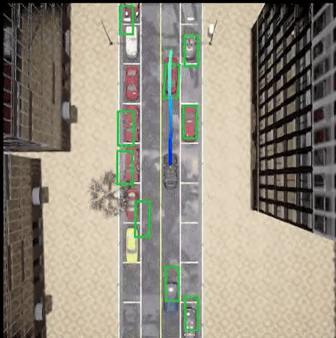
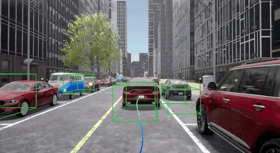

# Project3 Query-based Planner模型实现与可视化

## 1. 项目目标

通过补全`DriveTransformer`规划部分的代码，理解和学习端到端网络架构预测agent轨迹的方法。通过**闭环**的形式在carla仿真环境中实现模型推理和轨迹可视化。

**注意事项：本次项目不同前两次项目的开环，本次为闭环，运行脚本和前两次有差别。**

## 2. 作业思路提示

完成本作业需要重点关注以下实现要点：

- 完成规划模块的Query初始化，并为其增加batch维度，适配批量计算；
- 基于注意力掩码矩阵，定义 agent/map/planning 的交互规则，实现指定主体间的注意力可见性控制；
- 全程校验张量运算的合法性，确保维度匹配、设备一致。

## 3. 操作步骤

提示：（1）project-3的开发需要在完成project-1&2的基础之上进行；（2）可以通过在代码中搜索关键词“project-3”，快速定位需要补全的代码区域。

### 3.1 规划Query初始化

**代码路径：**

```
drivetransformer_head.py
```

在开始编码前，先明确用到的核心特征含义和初始维度：

1. `ego_lcf_feat`：自车（ego）的本地坐标系特征，初始维度为 `[1, 1, 9]`，特征包含 `(vx, vy, ax, ay, w, length, width, vel, steer)`（分别对应横向速度、纵向速度、横向加速度、纵向加速度、角速度、车身长度、车身宽度、整车速度、方向盘转角）；
2. `ego_his_trajs`：自车历史轨迹特征，初始维度为 `[1, 2, 2]`；
3. `ego_fut_cmd`：自车未来指令特征，初始维度为 `[1, 1, 140]`。

**具体实现步骤**

请严格按照以下维度变换和拼接逻辑编写代码：

**步骤 1：维度压缩**

- 将 `ego_lcf_feat [1, 1, 9]` 压缩为 `[1, 9]`（去除多余的维度，可使用 `squeeze()` 方法）；
- 将 `ego_his_trajs [1, 2, 2]` 展平为 `[1, 4]`（可使用 `flatten()` 或 `reshape()` 方法）；
- 将 `ego_fut_cmd [1, 1, 140]` 压缩为 `[1, 140]`（去除多余的维度）。

**步骤 2：特征拼接**

将上述处理后的三个特征按维度拼接，得到 `[1, 153]` 的组合特征（9+4+140=153），拼接时需注意维度对齐（使用 `torch.cat()`，指定拼接维度为 -1 或 1）。

**步骤 3：特征编码**

将拼接后的 `[1, 153]` 特征传入 `self.ego_lcf_encoder()` 编码器，得到最终维度为 `[1, 768]` 的 `ego_query`。

```python
## Planning
## ego_lcf_feat: (vx, vy, ax, ay, w, length, width, vel, steer)
###################################################################
# project-3
# TODO-5
# ego_query = self.ego_lcf_encoder()
# ego_lcf_feat [1, 1, 9] -> [1, 9]
# ego_his_trajs [1, 2, 2] -> [1, 4]
# ego_fut_cmd [1, 1, 140] -> [1, 140]
# ego_traj = cat[ego_lcf_feat, ego_his_trajs, ego_fut_cmd] -> [1, 153]
# ego_query = self.ego_lcf_encoder(ego_traj)  # [1, 768]
# 替换此处代码
ego_query = torch.randn(1, self.embed_dims).to("cuda")

###################################################################
```

### 3.2 注意力机制的mask设计

**代码路径：**

```
drivetransformer_layers.py
```

需要完成 Project-3 中关于`attention`可见性（mask）的代码替换。

核心规则是：任务间不可见（mask=True），任务内部可见（mask=False），不同 project 对应不同的“可见对象”规则，以下是详细说明和实现代码。

**核心逻辑说明**

首先明确几个关键概念：

- mask=True：表示两个对象之间不可见（遮挡）；
- mask=False：表示两个对象之间可见（无遮挡）；

涉及的对象类型：agent（智能体）、map（地图）、ego（自车）。

**实现思路**

先定义一个基础的 mask 矩阵（默认全为True，即所有对象间都不可见），根据各 project 的规则，将“允许可见”的对象对对应的 mask 值设为False；确保仅“任务内部”的对象可见，“任务间”保持不可见（mask=True）。

```python
# 设置任务间不可见（mask=True）
# 任务内部可见（mask=False）
##############################################################
# project-1
# 允许agent看agent
# 替换此处代码
pass
# 允许map看agent, map
# 替换此处代码
pass
###############################################################
# project-2
# 允许agent看agent, map
# 替换此处代码
pass
# 允许map看agent, map
# 替换此处代码
pass
###############################################################
# project-3
# 允许agent, map, ego互相看
# 替换此处代码
pass
###############################################################
```

### 3.3 轨迹预测解码

**代码路径：**

```
drivetransformer_layers.py
```

需要完成 Project-3 中 TODO-8 的代码替换，核心目标是实现 `refine` 模式下自车轨迹（ego_traj）的精细化计算，以及非 `refine` 模式下轨迹结果的直接赋值，最终得到符合指定维度的规划轨迹结果。

**核心任务说明**

整个逻辑分为 **refine=True（精细化模式）** 和 **refine=False（非精细化模式）** 两个分支：

1. **refine=True**：
	- 先拼接 `ego_query` 和 `ego_pos_embed` 得到输入特征；
	- 对 `ego_traj_branches_fix_dist`（固定距离分支）：通过分支网络计算粗轨迹，与原有轨迹叠加得到精细化轨迹；
	- 对 `ego_traj_branches_fix_time`（固定时间分支）：同理计算粗轨迹并叠加，得到精细化轨迹；
2. **refine=False**：直接将粗轨迹结果赋值给最终轨迹变量，无需叠加。

**关键维度说明**

1. 精细化模式（self.refine = True）

	**第一步：构建输入特征**

	将 `ego_query` 和 `ego_pos_embed` 两个特征进行逐元素相加，得到输入特征（记为 `input_feat`），这个输入特征的维度保持为 [1, 1, 768]，是后续所有分支网络的统一输入。

	**第二步：处理固定距离分支（ego_traj_branches_fix_dist）**

	- 先判断 `ego_traj_branches_fix_dist` 是否不为空，若不为空则执行后续操作；
	- 调用 `ego_traj_branches_fix_dist[lid]` 并传入第一步构建的输入特征，得到该分支输出的粗轨迹（记为 `ego_traj_ref_fix_dist_refine`），此时粗轨迹的维度是 [1, 1, 20]；
	- 对上述粗轨迹进行维度扩展：在最后一维增加一个维度（使用 `unsqueeze(-1)` 方法），将维度从 [1, 1, 20] 调整为 [1, 1, 20, 1]，确保和待叠加的 `ego_traj_ref_fix_dist` 维度一致；
	- 将调整维度后的粗轨迹与原有轨迹 `ego_traj_ref_fix_dist` 进行逐元素相加，得到精细化后的固定距离轨迹 `ego_traj_ref_fix_dist`，最终维度为 [1, 1, 20, 1]。

	**第三步：处理固定时间分支（ego_traj_branches_fix_time）**

	- 调用 `ego_traj_branches_fix_time[lid]` 并传入第一步构建的输入特征，得到该分支输出的粗轨迹（记为 `ego_traj_ref_fix_time_refine`），此时粗轨迹的维度是 [1, 1, 60]；
	- 对上述粗轨迹进行维度`reshape`：将一维的 60 维特征拆分为 30 个时间步、每个时间步 2 维坐标的形式（使用 `reshape` 方法），把维度从 [1, 1, 60] 调整为 [1, 1, 30, 2]，确保和待叠加的 `ego_traj_ref_fix_time` 维度一致；
	- 将调整维度后的粗轨迹与原有轨迹 `ego_traj_ref_fix_time` 进行逐元素相加，得到精细化后的固定时间轨迹 `ego_traj_ref_fix_time`，最终维度为 [1, 1, 30, 2]。

2. 非精细化模式（self.refine = False）

	无需进行维度调整和轨迹叠加操作，直接将固定距离分支的粗轨迹 `ego_traj_ref_fix_dist_refine` 赋值给最终的固定距离轨迹变量 `ego_traj_ref_fix_dist`，同时将固定时间分支的粗轨迹 `ego_traj_ref_fix_time_refine` 赋值给最终的固定时间轨迹变量 `ego_traj_ref_fix_time` 即可。

**关键注意点**

1. 维度匹配是核心：无论是固定距离分支的维度扩展，还是固定时间分支的维度重塑，最终目的都是让粗轨迹和原有轨迹的维度完全一致，否则会出现张量维度不匹配的报错。
2. 变量合法性：`lid` 必须是 `ego_traj_branches_fix_dist` 和 `ego_traj_branches_fix_time` 列表的有效索引，且叠加前的 `ego_traj_ref_fix_dist`、`ego_traj_ref_fix_time` 需已初始化且维度正确。
3. 设备一致性：若使用 GPU 训练 / 推理，需确保所有参与计算的张量（输入特征、粗轨迹、原有轨迹）都在同一设备（如 cuda）上，避免设备不匹配的错误。

```python
# planning
if self.refine:

#####################################################################
	 # project-3
	 # TODO-8 get planning result
	 # 替换此处代码
	 # input = ego_query + ego_pos_embed  # [1, 1, 768]
	 if ego_traj_branches_fix_dist is not None:
		  # 替换此处代码
		  # ego_traj_ref_fix_dist_refine = ego_traj_branches_fix_dist[lid](input)  # shape: [1, 1, 20] -> [1, 1, 20, 1]
		  # ego_traj_ref_fix_dist = ego_traj_ref_fix_dist_refine + ego_traj_ref_fix_dist
		  # ego_traj_ref_fix_dist: [1, 1, 20, 1]
		  pass
	 # 替换此处代码
	 # ego_traj_ref_fix_time_refine = ego_traj_branches_fix_time[lid](input)  # [1, 1, 60] -> [bs, ego_query.shape[1], 30, 2]
	 # ego_traj_ref_fix_time = ego_traj_ref_fix_time_refine + ego_traj_ref_fix_time
	 # ego_traj_ref_fix_time: [1, 1, 30, 2]
else:
	 # 替换此处代码
	 # ego_traj_ref_fix_dist = ego_traj_ref_fix_dist_refine
	 # ego_traj_ref_fix_time = ego_traj_ref_fix_time_refine
	 pass

######################################################################
```

### 3.4 启动脚本

项目提供专用启动脚本，用于一键触发闭环评测全流程，规避手动逐行执行命令的繁琐性，确保环境变量、模型加载、仿真启动等环节的一致性。

**提示：你需要修改脚本中的路径为自己的实际路径。**

执行以下命令启动**闭环评测**：

```bash
bash start_eval.sh
```




## 4. 作业提交说明

1. **代码文件**：仅提交修改/新增的文件，包括：
	- 上述代码填空所涉及的所有文件；
	- 其他自定义修改的文件（如leaderboard_evaluator.py的可视化开关，或者其他改动的文件都可提交）；
2. **可视化结果**：
	- 通过**闭环评测脚本**`start_eval.sh`，可视化检测框和ego预测轨迹的BEV和rgb_front前相机视角视频或动图gif：
	- 每帧图像含检测框和ego预测轨迹结果，如果提交视频，注意视频长度不要太长；
	- 有其他视频创意更好（加分项）。
3. **提交建议**：
	- 压缩包命名：`用户名-Project3.zip`，压缩包大小建议小于100M。
