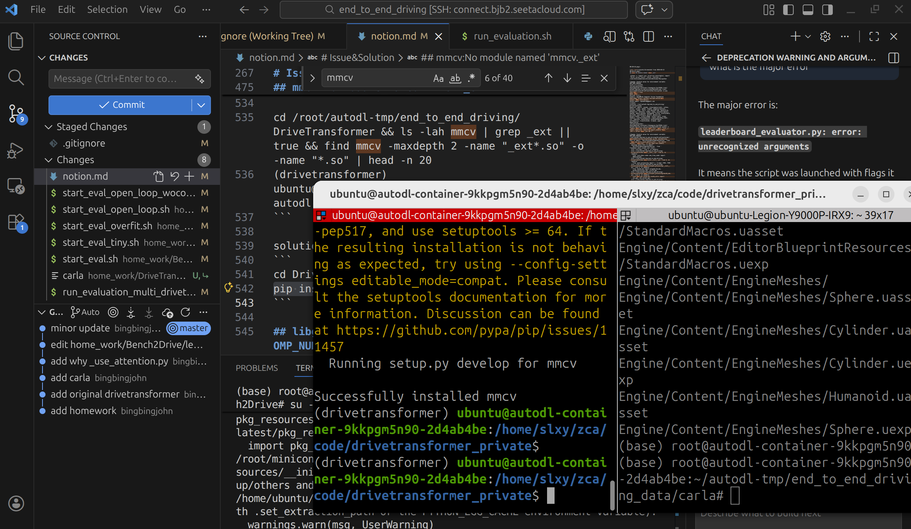
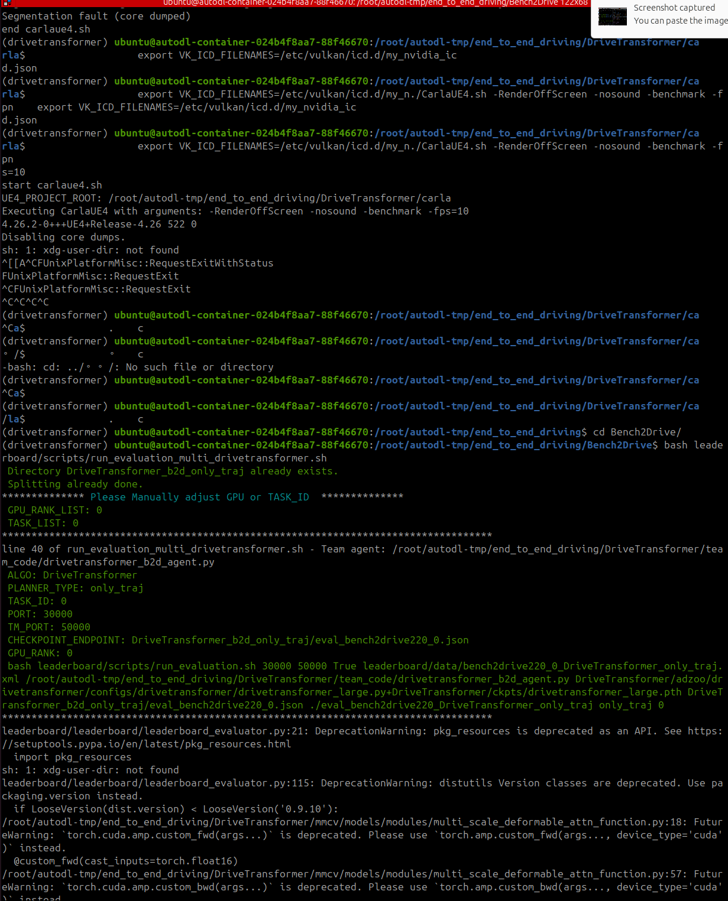
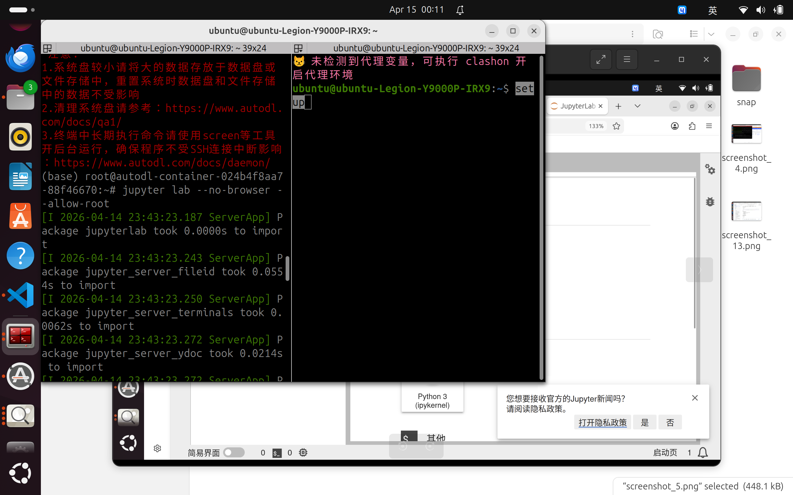

# 配置过程

## 环境要求

- Ubuntu 22.04（不支持 Windows / macOS）
- Python 3.8（硬性要求）、CUDA 11.8、GCC 9.4
- CARLA 0.9.15
- GPU：单卡 RTX 4090 可跑通推理与评测；完整训练需要多卡

## 快速开始

```bash
# 1. 创建环境
conda create -n drivetransformer python=3.8 -y
conda activate drivetransformer

# 2. CUDA Toolkit 与 PyTorch
conda install -c "nvidia/label/cuda-11.8.0" cuda-toolkit -y
pip install torch torchvision torchaudio --index-url https://download.pytorch.org/whl/cu118
pip install -U xformers --index-url https://download.pytorch.org/whl/cu118

# 3. 编译依赖与项目核心依赖
pip install ninja packaging
cd DriveTransformer && pip install -v -e .

# 4. 验证
python -c "import torch; print('CUDA:', torch.cuda.is_available()); print('GPU:', torch.cuda.get_device_name(0))"
```

`mmcv` 的三个预编译扩展（`_ext`、`iou3d_cuda`、`roiaware_pool3d_ext`）没有随仓库分发，需由第 3 步在本地编译生成——它们与 Python / CUDA 版本绑定，本地编译比直接拷贝更可靠。这一步耗时较久且长时间没有输出，属正常现象：



CARLA 权重与地图的安装步骤见 [lab1.md](../requirement/lab1.md) 环境配置一节。CARLA 正常启动后的样子：



## 运行

改脚本里的路径为本机实际路径后执行：

```bash
# 开环评测（Lab1 / Lab2）
bash Bench2Drive/start_eval_open_loop_wocontrol.sh

# 闭环评测（Lab3 / Lab4）
bash Bench2Drive/start_eval.sh
```

脚本会拉起 CARLA、加载权重、跑完 route，输出评测 json 与可视化帧。视频 demo 可用 `Bench2Drive/tools/generate_video.py` 生成。

Lab4 额外需要数据预处理与训练两步（数据集下载与目录结构见 lab4 说明）：

```bash
# 数据预处理（耗时较久，改脚本里的路径为本机实际路径）
cd DriveTransformer/adzoo/drivetransformer/mmdet3d_plugin/datasets
python preprocess_bench2drive_drivetransformer.py --workers 16

# 启动训练，末尾数字为 GPU 数
cd DriveTransformer
bash adzoo/drivetransformer/dist_train.sh \
  adzoo/drivetransformer/configs/drivetransformer/drivetransformer_large.py 8
```

`large` 配置显存需求高，单卡或显存不足时可下调配置里的 `batch_size`、网络层数、特征维度。这会影响精度，但 Lab4 的目的是跑通训练与评测全流程、拿到自己的权重，精度达不到官方水平是正常的。评测时 `--routes` 用 `bench2drive220.xml`（完整 220 条），资源有限可换 `drivetransformer_bench2drive_dev10.xml`。

## AutoDL 使用

没有本地显卡时可以租 AutoDL 实例。实例配置选 RTX 4090 + Ubuntu 22.04，Python 预选 3.8、CUDA 预选 11.8；代码和数据放 `/root/autodl-tmp`（系统盘空间不够）。

本地 VSCode 装 **Remote - SSH** 插件，`Ctrl+Shift+P` → `Remote-SSH: Connect to Host` 填实例给的 ssh 命令即可连上。连上后先验证环境：

```bash
nvidia-smi
python -c "import torch; print(torch.__version__, torch.cuda.is_available(), torch.cuda.get_device_name(0))"
```

JupyterLab 走 SSH 隧道访问：

```bash
# 本地开隧道（本地 8889 → 服务器 8889）
ssh -L 8889:localhost:8889 -p <端口> root@<服务器地址>

# 服务器上启动
jupyter lab --no-browser --allow-root --port=8889
```



### 常见问题

**`CommandNotFoundError: Your shell has not been properly configured to use 'conda activate'`**

```bash
source /root/miniconda3/etc/profile.d/conda.sh
```

**`carla: Refusing to run with the root privileges`** —— CARLA 不能以 root 启动，需建普通用户并放开权限：

```bash
useradd -m -s /bin/bash ubuntu
passwd ubuntu
chmod 755 /root                       # 必须，否则新用户读不到 conda
chmod 777 -R /root/autodl-tmp
echo ". /root/miniconda3/etc/profile.d/conda.sh" >> /home/ubuntu/.bashrc
su - ubuntu
```

**CARLA 直接启动失败 / `VK_ERROR_OUT_OF_HOST_MEMORY`** —— 云实例无物理显示器，用 Xvfb 造一个虚拟显示：

```bash
sudo apt update && sudo apt install -y xvfb
Xvfb :99 -screen 0 1024x768x24 &
export DISPLAY=:99
cd $CARLA_ROOT && ./CarlaUE4.sh -RenderOffScreen -nosound -benchmark -fps=10
# 验证
ps -ef | grep CarlaUE4 | grep -v grep
```

**`No module named 'mmcv._ext'`** —— 扩展没编译。回到 `DriveTransformer/` 执行 `pip install -v -e .`，注意用的必须是 conda 环境里那个 python（`python -c "import sys; print(sys.executable)"` 核对）。

**`libgomp: Invalid value for environment variable OMP_NUM_THREADS`**

```bash
export OMP_NUM_THREADS=1
```

**`LowLevelFatalError: bind: Address already in use`** —— 上一次的 CARLA 或评测进程没退干净：

```bash
ps -ef | grep -E "Carla|python" | grep -v grep   # 找到后 kill
```

**`ERROR: unable to parse the OpenDRIVE XML string`** —— 伴随 `failed to generate map` 与 `Aborted (core dumped)`，发生在 Loading the world 阶段。原因是地图文件传输不完整（如 `CarlaUE4/Content/Carla/Maps/Town13/OpenDrive/Town13.xodr` 截断），重新传输该 `.xodr` 并核对大小。
